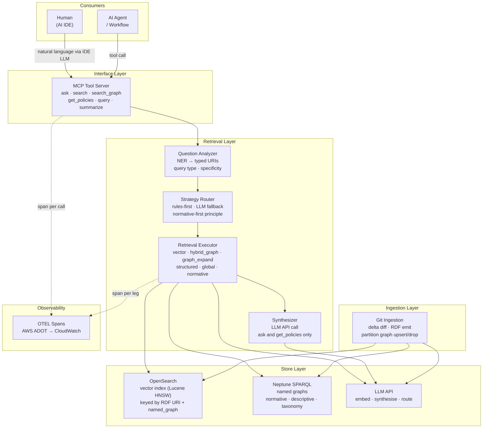
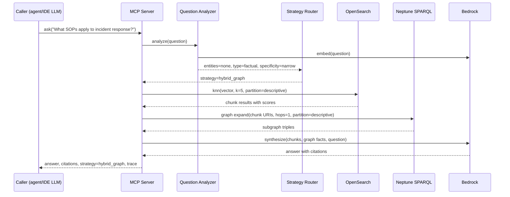
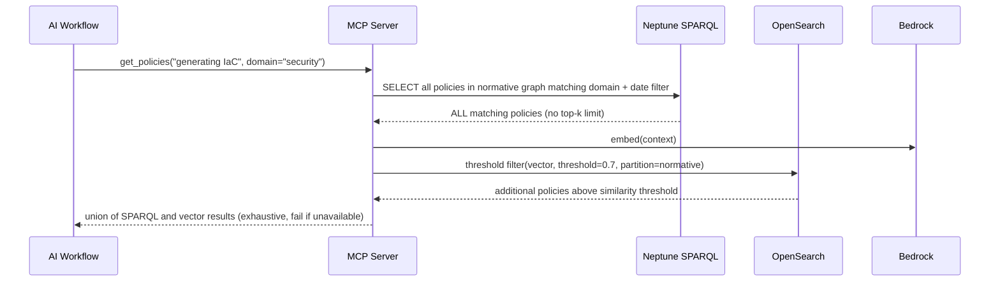
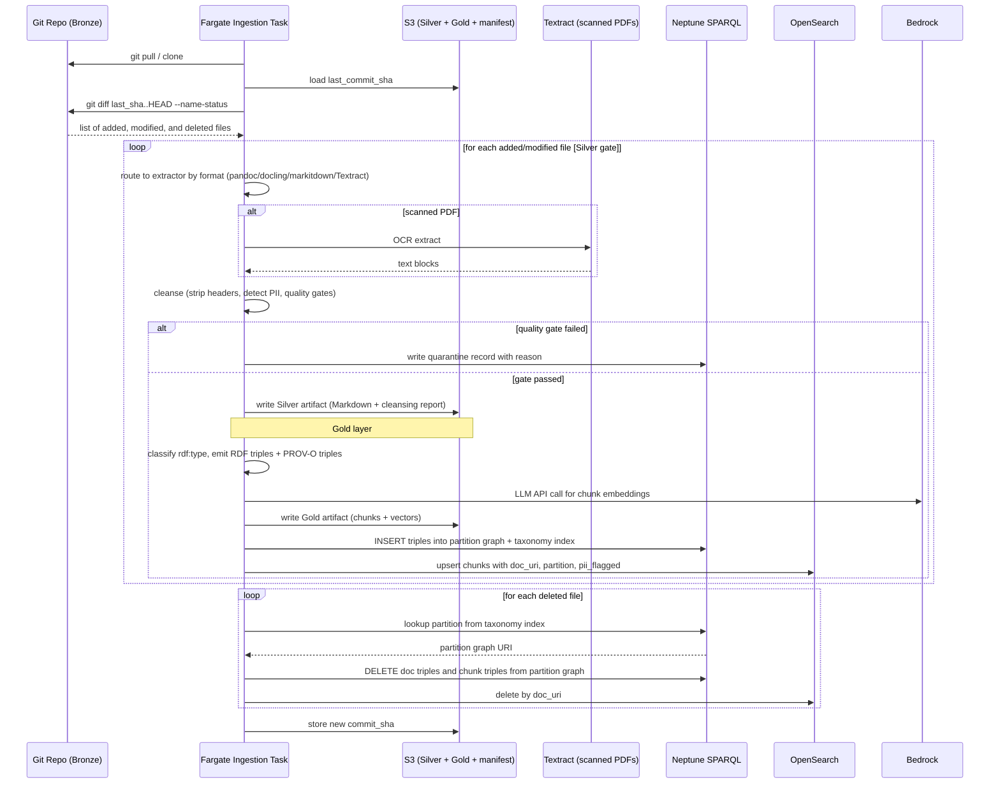
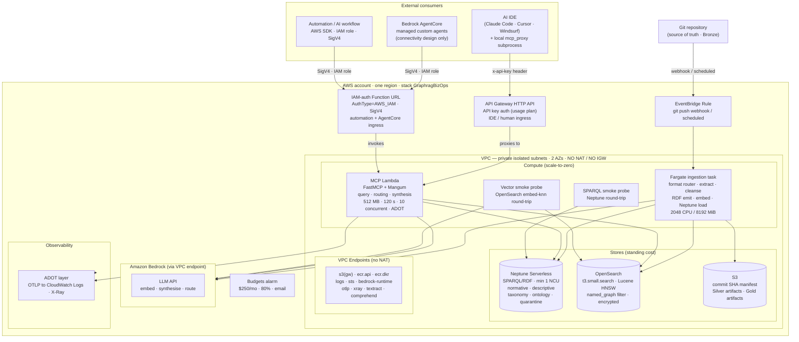

# Business Operations Knowledge Graph — Architecture

**Status:** Draft  
**Last updated:** 2026-07-23  
**Initiative:** ini-002 · M2  
**Supersedes:** [`graphrag-aws-architecture/design.md`](../graphrag-aws-architecture/design.md) (Kubernetes demo corpus design)

> Three views — conceptual, logical, physical — of the business operations knowledge
> platform. Read top-to-bottom for a full picture; jump to the physical view for
> infrastructure specifics.

---

## Conceptual View — What the system is

### Purpose

A knowledge platform that lets LLM agents and humans ask questions against a
governed corpus of business operations documents — standard operating procedures,
job aids, and transcripts — without knowing how retrieval works. Queries are
natural language. The platform routes to the right retrieval strategy internally
and returns an answer with a visible trace.

### Two kinds of knowledge, one platform

The platform holds two structurally different knowledge types that must not share
a retrieval path:

| Kind | Examples | Retrieval contract |
|---|---|---|
| **Normative** | Policies, standards, compliance rules, guidelines | Exhaustive recall — ALL applicable items returned; failure to find = compliance risk; hard fail if unavailable |
| **Descriptive** | SOPs, job aids, transcripts, domain documentation | Precision (best top-k match); a miss is "I don't know"; graceful degrade if unavailable |

Mixing them with the same retrieval semantics is unsafe: vector search optimises
for precision, not exhaustive recall. A policy worded differently from the query
could score below a content document and be silently dropped.

### Two kinds of consumer, one interface

Both reach the platform through **MCP** (Model Context Protocol):

```
Human in AI IDE (Claude Code, Cursor, Windsurf…)
    → types a question in natural language
    → IDE's LLM reads the MCP tool list
    → IDE's LLM calls the right tool (e.g. ask, get_policies)
    → platform executes, returns structured result
    → IDE's LLM presents the answer to the human

AI agent / workflow
    → reads the same MCP tool list
    → calls tools directly as part of its plan
    → uses tool results for reasoning, governance, or generation
```

The human never calls an MCP tool directly. The agent does. The platform is the
same for both.

### The ontology shapes everything

All knowledge in the platform is typed by an OWL ontology (schema-only, no
reasoning engine). The ontology is minimal and domain-agnostic — it covers the
document and grouping types that every business operations corpus shares, not any
specific business entity.

**Base classes** (anchored to Schema.org and SKOS — stable, well-understood):

```
schema:CreativeWork
    biz:SOP          ← Standard Operating Procedure
    biz:JobAid       ← Job Aid
    biz:Transcript   ← Meeting / session transcript
    biz:Chunk        ← Text chunk (retrieval unit)

schema:DigitalDocument
    biz:Policy
        biz:Standard
        biz:Guideline

skos:ConceptScheme
    biz:BusinessDomain   ← e.g. "Finance", "HR", "Ops"

skos:Concept
    biz:Journey          ← e.g. "Onboarding", "Incident Response"
```

**Key properties:**

```
biz:inDomain      CreativeWork → BusinessDomain
biz:inJourney     CreativeWork → Journey
biz:hasChunk      CreativeWork → Chunk
biz:scope         Policy      → BusinessDomain
biz:effectiveDate Policy      → xsd:date
biz:visibility    Resource    → xsd:string   (normative/descriptive/public)
```

The domain and journey taxonomy is expressed as SKOS concept instances — added at
runtime without changing the ontology schema. No business entity types (Person,
Product, Team) are in the base ontology; those are added by adopters as OWL
extensions if needed.

### Named graph partitioning

All data lives in Neptune SPARQL. Named graphs are the isolation boundary:

| Named graph | Contents | Retrieval semantics |
|---|---|---|
| `urn:graph:normative` | Policies, standards, guidelines — and their chunks | Exhaustive SPARQL + threshold vector; fail-safe |
| `urn:graph:descriptive` | SOPs, job aids, transcripts — and their chunks | Top-k vector + SPARQL expand; graceful degrade |
| `urn:graph:taxonomy` | SKOS domain/journey hierarchy + document→partition index | SPARQL lookup only |
| `urn:graph:ontology` | OWL schema (the ontology itself) | Read-only at query time |
| `urn:graph:quarantine` | Documents failing quality or PII gates | Quarantine review workflow; never dropped silently |

A SPARQL query against `urn:graph:normative` never touches `urn:graph:descriptive`
and vice versa — the named graph scope is a hard constraint, not a hint.

**Document triples live inside partition graphs, not in per-document graphs.** The
document URI (`urn:doc:{repo}:{path}`) is an RDF subject within its partition graph,
not a graph name. This is the mechanism that makes `FROM NAMED urn:graph:normative`
actually retrieve anything.

```sparql
-- load (simplified): triples go into the partition graph
INSERT DATA {
  GRAPH <urn:graph:descriptive> {
    <urn:doc:my-repo:sops/ir.md>   a biz:SOP ; schema:name "Incident Response SOP" .
    <urn:chunk:my-repo:sops/ir.md:0> a biz:Chunk ;
        prov:wasDerivedFrom <urn:doc:my-repo:sops/ir.md> .
  }
  -- taxonomy graph tracks partition membership for efficient deletes
  GRAPH <urn:graph:taxonomy> {
    <urn:doc:my-repo:sops/ir.md> biz:inPartition <urn:graph:descriptive> .
  }
}

-- delete (simplified): lookup partition, then delete by doc URI pattern
DELETE WHERE { GRAPH <urn:graph:descriptive> { <urn:doc:my-repo:sops/ir.md> ?p ?o } } ;
DELETE WHERE {
  GRAPH <urn:graph:descriptive> {
    ?chunk ?p ?o . ?chunk prov:wasDerivedFrom <urn:doc:my-repo:sops/ir.md>
  }
} ;
DELETE WHERE { GRAPH <urn:graph:taxonomy> { <urn:doc:my-repo:sops/ir.md> ?p ?o } }
```

The classification step (SOP/JobAid → descriptive; Policy/Standard/Guideline → normative)
happens during ingestion and determines which partition graph receives the triples.

### Git as the canonical source

Documents enter the platform from a git repository. The ingestion pipeline follows
a three-layer medallion architecture (Bronze → Silver → Gold → Serving). See the
[Medallion architecture](#medallion-architecture) section in the logical view for
the full pipeline.

1. Clones or pulls the source repo (Bronze — no S3 copy)
2. Diffs against the last-ingested commit SHA (stored in S3 manifest)
3. For added/modified files: extracts Markdown (Silver) → cleanses → classifies → chunks + embeds (Gold) → INSERT INTO partition graph + OpenSearch upsert
4. For deleted/renamed files: looks up partition from `urn:graph:taxonomy` → DELETE WHERE by doc URI from partition graph + chunks → removes OpenSearch docs by `doc_uri` filter
5. Stores the new commit SHA in S3

The document URI (`urn:doc:{repo}:{path}`) is the stable RDF subject key across both
stores. It is never used as a graph name.

> **Git remote egress:** the Fargate ingestion task must reach the git remote
> (`git clone` / `git pull`). Two options: (a) a NAT gateway on the ingestion
> subnet only (separate routing table, other subnets remain no-NAT); or (b) a
> CodePipeline source stage that mirrors the repo to S3, and the Fargate task
> reads from S3 — preferred, as it keeps the ingestion task fully VPC-private.
> This design is stated as a deployment-time choice; the recommended default is
> the CodePipeline/S3 mirror path.

### PII handling — flag and surface, not redact

When the extraction pipeline detects PII in a document:

1. The document is flagged: `biz:hasPII true` is set as an OWL property on the document URI.
2. The document stays in its **natural partition** based on its `rdf:type`
   (a PII-flagged transcript remains descriptive; a PII-flagged policy remains normative).
   Routing a PII-flagged SOP into the normative partition would corrupt the
   exhaustive-recall contract — PII sensitivity and knowledge kind are orthogonal dimensions.
3. At query time, all retrieval paths default to filtering `biz:hasPII false`. A caller
   must explicitly opt in to receive PII-flagged results. This is a **label and default filter**,
   not an enforced access control — real authorisation is out of scope in this template
   (see non-goals). Adopters who need enforcement must add an authz check on the query path.
4. The `pii_flagged` field in OpenSearch metadata enables the vector store to apply the
   same filter at the kNN level, not just in post-processing.
5. Every MCP response citing a PII-flagged document carries `"pii_flagged": true` in its
   citation so the caller can decide how to handle the result.
6. The document is **not redacted**. Redaction at extraction time destroys provenance.

PII detection uses regex patterns for common identifiers (email, phone, SSN, credit card,
national IDs) supplemented by AWS Comprehend when the `textract` and `comprehend` VPC
endpoints are provisioned (see endpoint list). The detection result and entity count are
written to the Silver-layer cleansing report alongside the document.

---

## Logical View — How the components relate

### Component architecture



### MCP server implementation stack

The MCP server is built on the **official Python MCP SDK** (`mcp` on PyPI,
`modelcontextprotocol/python-sdk`), using its `FastMCP` high-level API. This is
the canonical, Anthropic-maintained Python MCP server implementation.

```
mcp (FastMCP)         ← tool definitions, protocol handling, schema generation
  └─ streamable-http  ← HTTP transport (Lambda path)
  └─ stdio            ← local dev transport (mcp dev / Claude Desktop)
mangum                ← ASGI-to-Lambda adapter (bridges FastMCP's ASGI app to Lambda)
```

Tool definitions are plain decorated async functions — FastMCP generates the MCP
schema from type annotations automatically:

```python
from mcp.server.fastmcp import FastMCP

mcp = FastMCP("biz-ops-knowledge-platform")

@mcp.tool()
async def ask(question: str) -> dict:
    """Ask a question. Returns a synthesised answer, citations, and strategy trace."""
    ...

@mcp.tool()
async def get_policies(context: str, domain: str | None = None) -> list[dict]:
    """Retrieve ALL policies applicable to this context. Exhaustive — never top-k."""
    ...
```

**Two deployable targets from the same tool definitions:**

| Target | Transport | Adapter | When |
|---|---|---|---|
| AWS Lambda | `streamable-http` | `mangum` | Production / staging |
| Local / CI | `stdio` | none (`mcp dev`) | Development, Claude Desktop, Claude Code local |

The Lambda handler is simply the Mangum-wrapped FastMCP ASGI app:

```python
from mangum import Mangum
app = mcp.streamable_http_app()
handler = Mangum(app, lifespan="off")   # Lambda entrypoint
```

### Mock MCP server (offline-first development)

A mock server runs the same FastMCP tool definitions against in-memory stores —
no AWS credentials, no deployed stack. This preserves the repo's offline-first
posture and lets developers exercise the full MCP tool surface locally.

| Component | Live path | Mock path |
|---|---|---|
| Graph store | Neptune SPARQL | `rdflib` in-memory SPARQL (offline substitute) |
| Vector store | OpenSearch Lucene HNSW | `store/vector_memory.py` (cosine, in-memory) |
| Embedder | LLM API call (vector) | `HashEmbedder` (deterministic, non-semantic) |
| Synthesizer | LLM API call (text) | `TemplateSynthesizer` (deterministic template) |
| SPARQL router | Rule + LLM fallback | `RuleQueryRouter` only (deterministic) |

The mock server starts with `mcp dev` (stdio) or `python -m graphrag.mcp --mock`
(streamable-http on localhost:8000). The fixture corpus in
`packages/graphrag/tests/fixtures/` seeds the in-memory stores at startup.

The mock is also the CI surface — the offline gate suite exercises all six tools
against the fixture corpus without an AWS account.

### Client deployment model

Three connection modes, one MCP tool surface. The mode is a local config choice;
the tool definitions and response schema are identical across all three.

| Mode | Transport | Auth | Principal |
|---|---|---|---|
| **Local mock** | stdio (subprocess) | None | Developer (offline) |
| **Production — IDE/human** | HTTPS → API Gateway HTTP API | API key (`x-api-key` header) | Developer in AI IDE |
| **Production — automation** | HTTPS → Function URL | SigV4 (IAM) | AI agent or workflow with an IAM role |
| **Production — AgentCore** | HTTPS → Function URL | SigV4 (IAM execution role) | Managed custom agent on Bedrock AgentCore — connectivity design only; agents not in build plan |

**Mode 1 — Local mock**

The IDE spawns the mock server as a subprocess. No auth, no network, no AWS credentials.

```json
// .claude/mcp.json  (or ~/.claude/mcp.json for global)
{
  "mcpServers": {
    "biz-ops-kg": {
      "command": "python",
      "args": ["-m", "graphrag.mcp", "--mock"],
      "cwd": "packages/graphrag"
    }
  }
}
```

Same config schema works for Cursor (`.cursor/mcp.json`) and Windsurf — different
file location, identical structure.

**Mode 2 — Production, IDE/human via API Gateway**

An **API Gateway HTTP API** sits in front of the MCP Lambda as the human developer
ingress. Auth is an API key via an API Gateway usage plan — the IDE sends
`x-api-key: <key>` on every request. This provides request identification and
throttling, **not authentication** (API keys are not an auth control per AWS
guidance; real authz is out of scope in this template). Keys are issued per developer
by the platform operator and stored locally (env var or OS keychain).

> **Timeout constraint:** API Gateway HTTP API enforces a hard 30 s integration
> timeout regardless of the Lambda's own timeout setting. The `ask` synthesis path
> (embed → vector → graph expand → LLM call) must complete within 30 s on the human
> path. The Function URL automation path is unaffected (up to 15 min).
> `streamable-http` is used in non-streaming request/response mode behind API Gateway;
> response streaming is not supported by the HTTP API integration.

A local **MCP proxy** (`packages/graphrag/mcp_proxy`) bridges the IDE to API Gateway.
It is a subprocess the IDE spawns — same pattern as the mock server — but it forwards
requests over HTTPS with the API key header added:

```
IDE (stdio MCP) ↔ mcp_proxy subprocess ↔ HTTPS + x-api-key ↔ API Gateway ↔ Lambda
```

```json
// .claude/mcp.json
{
  "mcpServers": {
    "biz-ops-kg": {
      "command": "python",
      "args": [
        "-m", "graphrag.mcp_proxy",
        "--url", "https://<api-gw-id>.execute-api.<region>.amazonaws.com/prod"
      ],
      "env": { "BIZ_OPS_MCP_API_KEY": "${BIZ_OPS_MCP_API_KEY}" }
    }
  }
}
```

The proxy is intentionally thin — its only job is to translate stdio MCP frames to
signed HTTPS requests with the key header. It carries no retrieval logic.

**Mode 3 — Production, automation via Function URL**

AI agents and workflows that run with an IAM role use the IAM-auth Function URL
directly. SigV4 signing is handled by the AWS SDK; no proxy is needed. The
Function URL is the automation ingress; API Gateway is the human developer ingress.
They are separate access paths for separate principal types and can be revoked
independently.

### MCP tool surface (generic typed tools)

Six tools cover the full retrieval surface. Generic typing (not per-class) satisfies
org MCP approval policy — one approval covers the whole tool set.

| Tool | What it returns | When the LLM calls it |
|---|---|---|
| `ask(question)` | Synthesised answer + citations + strategy trace | Human wants a direct answer; agent wants pre-synthesised result |
| `search(question, type?, k?)` | Ranked typed RDF resources (chunks/docs) | Agent inspects or re-ranks raw results before synthesising |
| `search_graph(uri, hops?)` | Typed subgraph (nodes + edges from named graph) | Agent reasons over relationships; entity neighbourhood lookup |
| `get_policies(context, domain?)` | All applicable Policy resources (exhaustive) | AI workflow retrieves normative constraints before acting |
| `query(template_name, params)` | Typed SPARQL template result | Known structural question; no LLM needed for query generation |
| `summarize(topic)` | Community/thematic synthesis | Broad thematic question spanning many documents |

`ask` and `get_policies` synthesise internally. `search`, `search_graph`, `query`,
and `summarize` return raw typed resources — the IDE's LLM or the agent synthesises.

### Strategy routing matrix

The `ask` tool routes internally. Rules fire first; the Bedrock router fires only
for ambiguous cases.

| Detected signal | Strategy | Stores touched |
|---|---|---|
| Aggregation verb + entity or class | Structured SPARQL | Neptune only |
| Named entity URI + relationship verb | Graph expand (SPARQL property paths) | Neptune only |
| Named entity URI + factual verb | Hybrid GraphRAG (vector seeds → graph expand) | OpenSearch + Neptune + Bedrock embed |
| No entity + specific factual | Vector only | OpenSearch + Bedrock embed |
| No entity + thematic / broad | Global / community | Neptune taxonomy + Bedrock synthesise |
| `get_policies` call (always) | Normative exhaustive | Neptune `urn:graph:normative` + vector threshold |
| Ambiguous / mixed | Hybrid GraphRAG (default) | OpenSearch + Neptune + Bedrock embed |

**Normative-first principle:** AI workflows call `get_policies` before any
descriptive retrieval. The policy constraints govern what the agent may do with
descriptive knowledge, regardless of what that knowledge says. This ordering is
enforced by convention, not by the platform — but the platform makes it easy by
keeping the tools distinct.

### Query data flows

**`ask(question)` — hybrid GraphRAG path (most common):**



**`get_policies(context, domain)` — normative exhaustive path:**



### Ingestion data flow



### OTEL observability

Every `ask` / `get_policies` call produces a span tree:

```
Span: mcp.tool_call  {tool, question_hash, strategy_decided}
  └─ Span: analyzer.run         {entity_count, query_type, specificity}
  └─ Span: router.decide        {strategy, decided_by: rule|bedrock}
  └─ Span: retrieval.vector     {store: opensearch, k, named_graph, hits}
  └─ Span: retrieval.graph      {store: neptune, hops, triples_returned}
  └─ Span: synthesizer.run      {model_id, tokens_in, tokens_out, latency_ms}
```

**Content is off by default.** The question text and document content are not
captured in spans — they carry disclosure risk. An opt-in `OTEL_CONTENT_CAPTURE`
env var enables content capture for debugging; it must not be set in production
without data classification sign-off.

Spans ship to AWS ADOT (Lambda layer) → CloudWatch OTLP endpoint. No NAT required;
a VPC interface endpoint for `xray` / OTLP handles egress within the private
subnet.

### Medallion architecture

The ingestion pipeline follows a three-layer medallion architecture. Each layer
produces immutable S3 artifacts keyed by document URI + commit SHA.

| Layer | Contents | S3 key pattern | Notes |
|---|---|---|---|
| **Bronze** | Raw files in the source git repository | Git repo only — no S3 copy | Canonical source of truth |
| **Silver** | Extracted Markdown + cleansing report per document | `silver/<repo>/<path>/<sha>.md` | Extraction gate; PII flagged here |
| **Gold** | Text chunks + embedding vectors per document | `gold/<repo>/<path>/<sha>.chunks.json` | Feeds both Neptune and OpenSearch |
| **Serving** | RDF triples (Neptune named graphs) + vector index (OpenSearch) | Neptune + OpenSearch | Live query path |

**Silver is the extraction gate.** A document graduates from Silver to Gold only when:
- Extraction produced valid Markdown with at least one structural element (heading, paragraph, list)
- Cleansing passed all quality gates (no zero-content, no binary blob residue)
- PII detection completed and partition routing is decided

Documents that fail the Silver gate are written to `urn:graph:quarantine` with a
`biz:quarantineReason` triple — never silently dropped.

**Gold is immutable per commit SHA.** When a document changes (git delta), a new Gold
artifact is written for the new SHA. Neptune and OpenSearch are updated in-place
(SPARQL LOAD + OpenSearch upsert), but the S3 artifact history remains for provenance.

> **Naming note:** ADR-0007 refers to a "silver cache" — this is the **Gold layer** in
> medallion terminology. The Silver layer (extraction + cleansing) is new in ini-002.
> ADR-0007 will be superseded and its artifact renamed when the new ingestion pipeline ships.

### Extraction pipeline — format router

The Silver-layer extraction step uses a **format-specific router** rather than a
single universal extractor. This produces higher-quality Markdown across the document
formats common in business operations corpora.

| Source format | Extractor | Rationale |
|---|---|---|
| `.docx` (Word) | **pandoc** (via `pypandoc`) | Highest structural fidelity for Word heading styles, lists, and tables; maps Word styles to GFM headings cleanly; handles complex nested structures and tracked changes |
| `.pptx` (PowerPoint) | **markitdown** | Only viable pure-Python option; extracts text, tables, speaker notes per slide |
| `.pdf` (digital, text-layer) | **docling** (IBM, CPU-only, baked weights) | ML layout detection; production-grade GFM table extraction; handles multi-column layouts and complex structures that pdfminer-based tools collapse to run-on paragraphs |
| `.pdf` (scanned / image-only) | **AWS Textract** (via VPC endpoint) | Managed OCR; no OCR model in the Fargate container; output formatted to Markdown by a post-processor |
| `.xlsx` (Excel) | **markitdown** (pandas) | DataFrame → Markdown table; `openpyxl` fallback for multi-sheet workbooks |
| `.md` / `.txt` / `.rst` | Pass-through | Already Markdown or plain text |

**Why not markitdown alone?** markitdown uses `pdfminer.six` for PDF extraction.
For complex PDF layouts (tabular SOPs, multi-column policies), it degrades tables to
run-on paragraphs and loses headings — producing poor chunking inputs. It remains the
right choice for PPTX and XLSX where it wraps `python-pptx` and pandas directly.

**Why not unstructured alone?** The open-source tier bundles LibreOffice and
detectron2, producing a 5.7 GB+ Docker image that is impractical in Fargate.

**Fargate task sizing for docling:** The ingestion task is sized at 2048 CPU / 8192 MiB.
The docling PyTorch stack (~2.4 GB model weights) cannot load into a 1 GB task — the
task OOMs before processing the first PDF. Model weights are baked into the Docker image
layer at build time; `TRANSFORMERS_OFFLINE=1` and `HF_DATASETS_OFFLINE=1` are set at
runtime to prevent network calls from the private VPC. CPU inference runs at approximately
40 s per document; SQS-buffered async ingestion is preferred over synchronous invocation
for large document batches.

**License note:** `pymupdf4llm` (alternative PDF extractor) is AGPL-licensed; legal
review required before adoption in a closed-source pipeline. docling is MIT/Apache 2.0.

### Cleansing pipeline

After extraction, each Silver document passes through a cleansing step that runs
synchronously in the Fargate task before Gold artifact generation.

| Gate | What it checks | On failure |
|---|---|---|
| **Minimum content** | Extracted text ≥ 200 characters after stripping artifacts | Route to `urn:graph:quarantine` |
| **Structure check** | At least one heading or paragraph block | Route to `urn:graph:quarantine` |
| **Header/footer removal** | Page numbers, running headers, section footers (regex + position heuristic) | Strip and continue |
| **PII detection** | Email, phone, SSN, credit card, national IDs (regex); optionally AWS Comprehend | Flag `biz:hasPII true`; document stays in its natural partition (routing unchanged by PII flag) |
| **Binary residue** | Non-UTF-8 blocks > 10% of content (embedded objects encoded as text) | Strip block and continue |

The cleansing report is a JSON sidecar written to S3 alongside the Silver Markdown:

```json
{
  "doc_uri": "urn:doc:my-repo:sops/incident-response.md",
  "sha": "abc123def",
  "extractor": "pandoc",
  "char_count_raw": 8420,
  "char_count_clean": 8100,
  "gates_passed": ["min_content", "structure", "pii_scan"],
  "gates_failed": [],
  "pii_flagged": false,
  "pii_entities_detected": 0,
  "quarantined": false,
  "headers_stripped": 12,
  "binary_blocks_stripped": 0
}
```

### Provenance model (PROV-O)

Every document and chunk carries W3C PROV-O provenance triples in the same named
graph as its content. Provenance is written during Gold artifact generation and loaded
into Neptune as part of the SPARQL LOAD step.

**Document provenance:**

```turtle
<urn:doc:my-repo:sops/incident-response.md>
    a biz:SOP, prov:Entity ;
    schema:name "Incident Response SOP" ;
    prov:wasGeneratedBy <urn:activity:ingest:my-repo:abc123def> ;
    prov:generatedAtTime "2026-07-23T10:00:00Z"^^xsd:dateTime ;
    biz:gitRepo "my-repo" ;
    biz:gitPath "sops/incident-response.md" ;
    biz:gitCommitSHA "abc123def" ;
    biz:extractorUsed "pandoc" ;
    biz:silverArtifact "s3://<bucket>/silver/my-repo/sops/incident-response.md/abc123def.md" ;
    biz:hasPII false .
```

**Chunk provenance:**

```turtle
<urn:chunk:my-repo:sops/incident-response.md:3>
    a biz:Chunk, prov:Entity ;
    prov:wasDerivedFrom <urn:doc:my-repo:sops/incident-response.md> ;
    prov:generatedAtTime "2026-07-23T10:00:00Z"^^xsd:dateTime ;
    schema:name "Initial Response Steps" ;
    biz:chunkIndex 3 ;
    biz:embeddingModel "amazon.titan-embed-text-v2:0" ;
    biz:embeddingDimensions 256 .
```

Provenance triples live in the same named graph as the document content — not a
separate provenance graph. This keeps `FROM NAMED` scoping intact: a query against
`urn:graph:normative` retrieves provenance for normative documents without
cross-partition leakage.

### Citation format in MCP responses

The `ask`, `search`, and `get_policies` tools include a `citations` array in every
response. Citations are resolved from PROV-O triples at answer generation time — the
synthesizer receives chunk URIs, resolves their provenance from Neptune, and embeds
the metadata in the response.

```json
{
  "answer": "The incident response SOP requires...",
  "strategy": "hybrid_graph",
  "trace": {
    "router": "rule",
    "rule_matched": "entity_uri+factual",
    "legs": ["vector", "graph_expand"]
  },
  "citations": [
    {
      "uri": "urn:doc:my-repo:sops/incident-response.md",
      "title": "Incident Response SOP",
      "section": "Initial Response Steps",
      "chunk_uri": "urn:chunk:my-repo:sops/incident-response.md:3",
      "domain": "Operations",
      "journey": "Incident Response",
      "git_commit": "abc123def",
      "git_path": "sops/incident-response.md",
      "effective_date": null,
      "relevance": 0.94,
      "pii_flagged": false
    }
  ]
}
```

Normative citations (from `get_policies`) additionally carry `effective_date` and
`doc_id` fields. The `pii_flagged` field is always present — a `true` value signals
the caller that the source document is flagged for elevated clearance.

---

## Physical View — Where it runs on AWS

### Infrastructure topology



### AWS resource summary

| Resource | Config | Role |
|---|---|---|
| **Neptune Serverless** | SPARQL/RDF engine · min 1.0 NCU · max 2.5 NCU · IAM-auth | Graph store — named graph partitioning for normative/descriptive/quarantine isolation |
| **OpenSearch** | Single-node `t3.small.search` · 10 GB gp3 · Lucene HNSW | Vector store — chunks keyed by RDF URI; `named_graph` field for partition filter |
| **Lambda: MCP** | Python 3.12 · 512 MB · 120 s · 10 concurrent · ADOT layer | FastMCP (`mcp` SDK) + Mangum ASGI adapter — all retrieval modes |
| **Lambda: SPARQL probe** | Python 3.12 · 60 s | In-VPC Neptune SPARQL round-trip smoke probe |
| **Lambda: vector probe** | Python 3.12 · 120 s | In-VPC embed→knn round-trip smoke probe |
| **Fargate ingestion task** | 2048 CPU / 8192 MiB · on-demand | Format router · extract (pandoc/docling/markitdown/Textract) · cleanse · RDF emit · embed · SPARQL LOAD. 8 GB required to load docling model weights (~2.4 GB PyTorch stack) at runtime. |
| **EventBridge rule** | Git webhook or scheduled pull | Triggers Fargate ingestion on corpus change |
| **API Gateway HTTP API** | Usage plan · API key auth | Human / IDE ingress — MCP over HTTPS; API key per developer, no SigV4 on the client |
| **IAM-auth Function URL** | AuthType=AWS_IAM · SigV4 | Automation + AgentCore ingress — MCP over HTTPS; SigV4 signed by AWS SDK |
| **S3 bucket** | Block-public · encrypted · TLS-only | Commit SHA manifest · Silver artifacts (extracted Markdown + cleansing reports) · Gold artifacts (chunks + embedding vectors) |
| **ADOT Lambda layer** | AWS Distro for OpenTelemetry | OTLP span export to CloudWatch — attached to MCP Lambda |
| **VPC endpoints** | s3(gw) · ecr.api · ecr.dkr · logs · sts · bedrock-runtime · otlp · textract · comprehend | All egress stays inside VPC — no NAT, no IGW. `textract` and `comprehend` required for scanned PDF OCR and optional PII detection. |
| **Budgets alarm** | $250/mo · 80% threshold · email | Set above the computed standing-cost floor: Neptune min NCU (~$110/mo) + OpenSearch t3.small (~$26/mo) + interface VPC endpoints (~$90/mo) ≈ $226/mo before any traffic. |

### IAM roles (least privilege — no wildcard Resource)

| Role | Neptune SPARQL | OpenSearch | Bedrock | S3 |
|---|---|---|---|---|
| `ingestion_task_role` | ReadDataViaQuery + WriteDataViaQuery + connect | `es:ESHttp*` | embed + synthesise (Invoke + Converse) | read + scoped PutObject: `manifest/*`, `silver/*`, `gold/*` |
| `mcp_lambda_role` | **ReadDataViaQuery + connect ONLY** | `es:ESHttp*` | embed + synthesise (Invoke + Converse) | — |
| `sparql_probe_role` | ReadDataViaQuery + WriteDataViaQuery + connect | — | — | — |
| `vector_probe_role` | — | `es:ESHttp*` | embed (Invoke only) | — |

The `mcp_lambda_role` cannot write or delete graph data — this is the primary
blast-radius containment for LLM-generated SPARQL (Text2SPARQL guard, successor to
ADR-0004).

### Neptune SPARQL endpoint differences from openCypher

The engine swap (ADR-0011) changes how Neptune is accessed:

| Concern | openCypher (old) | SPARQL/RDF (new) |
|---|---|---|
| Query endpoint | `/openCypher` | `/sparql` |
| Query language | openCypher | SPARQL 1.1 |
| IAM action | `neptune-db:ReadDataViaQuery` (same) | `neptune-db:ReadDataViaQuery` (same) |
| Write endpoint | `/openCypher` | `/sparql` (SPARQL Update) |
| Data format | Property graph | RDF triples (Turtle, N-Triples, JSON-LD) |
| Bulk load | CSV via Loader API | Turtle/N-Triples via Loader API (same S3 path) |
| Named graphs | Not available | First-class (`FROM NAMED`, `GRAPH {}`) |
| Offline substitute | `store/neptune_memory.py` (dict) | `store/neptune_sparql_memory.py` (rdflib in-memory) |

The VPC topology, subnet placement, IAM auth mechanism, and security group rules
are unchanged.

### OpenSearch mapping changes

The chunk document mapping gains two fields to support named graph scoping and
RDF-typed retrieval:

```json
{
  "_id":          "urn:chunk:my-repo:sops/incident-response.md:0",
  "rdf_type":     "biz:Chunk",
  "named_graph":  "urn:graph:descriptive",
  "doc_uri":      "urn:doc:my-repo:sops/incident-response.md",
  "source":       "sops/incident-response.md",
  "heading":      "Initial Response Steps",
  "text":         "...",
  "vector":       [0.12, -0.34, ...]
}
```

The `named_graph` field is used as a mandatory `bool.filter` on all retrieval
queries — a query against the descriptive partition never returns normative chunks
and vice versa. The filter composes with any visibility filter.

---

## Key design decisions (ADR cross-references)

| Decision | ADR / Spec | Summary |
|---|---|---|
| Neptune SPARQL/RDF over openCypher | ADR-0011 | Named graph support; standard SPARQL ecosystem; required for OWL ontology |
| OWL schema-only, no reasoning | ADR-0012 | Schema.org + SKOS base; more consumable template; avoids OWL reasoner operational overhead |
| Named graph normative/descriptive partition + quarantine | in ADR-0012 | Retrieval isolation; asymmetric failure semantics; prompt injection guard; no silent drops |
| Multi-strategy server-side routing | ADR-0013 | Caller-opaque; rules-first, LLM fallback; normative-first principle |
| MCP tool server (generic typed tools) | ADR-0014 | One approval covers whole tool set; generic `type?` param over per-class tools |
| OTEL to AWS ADOT, content off-by-default | ADR-0015 | Observability without disclosure risk; CloudWatch OTLP endpoint, no NAT |
| Git commit-SHA delta ingestion + medallion | ADR-0016 | Git as canonical source; Bronze/Silver/Gold layers; SPARQL DROP GRAPH for orphan removal |
| Format-specific extraction router | spec-ingestion-extraction-cleanse | pandoc/docling/markitdown/Textract per format; better table and heading fidelity than single extractor |
| PII flag and surface (not redact) | spec-ingestion-extraction-cleanse | `biz:hasPII true`; document stays in natural partition; default query filter excludes PII-flagged docs; adopters add authz |
| PROV-O provenance on chunks and documents | spec-provenance-citations | W3C PROV-O triples; git commit SHA; extractor used; Silver/Gold artifact URIs; resolved into MCP citations |

---

## Risks and failure modes

| Risk | First to break | Recovery path |
|---|---|---|
| **Bedrock throttled on normative path** | `get_policies` hard-fails (exhaustive recall contract); the SPARQL leg alone continues but the vector threshold leg is dropped | Retry-with-backoff in the retrieval executor; on sustained throttle, fall back to SPARQL-only normative retrieval and log a warning citation — do not silently return incomplete results |
| **Neptune cold-scale latency** | First query after idle period is slow (NCU scale-up from min floor) | Expected behaviour at min 1 NCU; document expected cold latency; smoke probe warms the cluster before production traffic |
| **OpenSearch node loss** | Vector retrieval unavailable; SPARQL-only path continues | Single-node — no failover. Rebuild: reset commit SHA manifest to trigger full re-ingest from Gold S3 artifacts. RTO depends on corpus size. Acknowledged posture: cost/teaching over HA. |
| **Neptune data loss** | Graph retrieval and normative path unavailable | Rebuild from Gold S3 artifacts (replay `INSERT DATA` from stored Turtle). Commit SHA manifest reset triggers re-ingest. |
| **Ingestion task OOM** | Any PDF processed by docling in an under-sized task | Task is sized at 8 GB; do not reduce below 4 GB. If corpus has no PDFs, docling can be excluded and task can downsize. |
| **Git remote unreachable** | Fargate task fails to clone/pull; no new corpus content ingested | Retry via EventBridge; investigate NAT/CodePipeline source path. The stored commit SHA is unchanged — no partial state. |
| **Gold S3 artifact missing** | Rebuild from Gold is impossible for affected documents | Re-ingest from git history using the commit SHA stored in the manifest as the base ref. Silver artifacts (if retained) can skip re-extraction. |

**Documented risk acceptances (non-goals):**
- Single-node OpenSearch, no HA — cost/teaching posture (ADR-0002); recovery via re-ingest from Gold
- No real ACL/authz — visibility labels and PII flags are labels, not enforced controls (ADR-0009)
- `get_policies` normative-first ordering enforced by convention, not by the platform — AI workflow callers must call `get_policies` before descriptive retrieval; the platform cannot enforce ordering across tool calls

---

## What this design does not cover

- Production HA / multi-AZ OpenSearch (single-node is deliberate cost/teaching posture; see ADR-0002)
- Real ACL / authorisation (visibility labels remain synthetic teaching stand-ins; see ADR-0009)
- OWL reasoning / materialised inference (schema-only by decision; see ADR-0012)
- Per-class MCP tools (rejected due to org approval policy; see ADR-0014)
- BM25/sparse retrieval leg (not in scope for this template; noted as future work)
- Cross-encoder reranking (not in scope for this template; noted as future work)
- Agent memory / multi-turn session state (stateless per invocation)
- Full PII redaction (flag+restrict is the chosen model; redaction destroys provenance)
- Quarantine review UI (quarantine graph is written; remediation workflow is out of scope)
