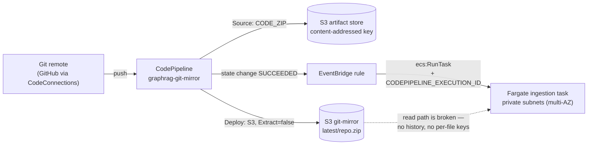
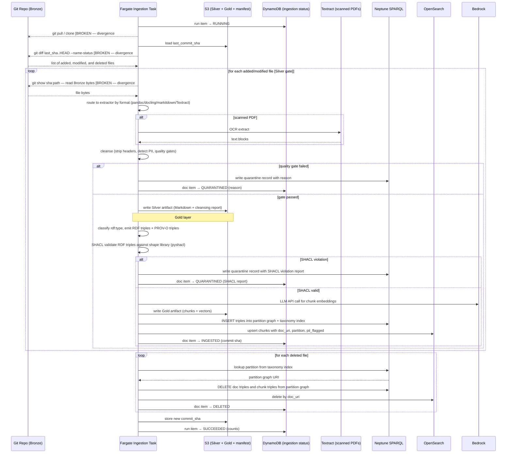

# Ingestion Pipeline — Architecture

**Status:** Draft — describes what is deployed, including the parts that are deployed and non-functional  
**Last updated:** 2026-09-22  
**Initiative:** ini-002 · M2  
**Parent:** [`design.md`](design.md) — the platform architecture set index  
**Open decision:** [RFC-0005](../../rfc/0005-git-repository-acquisition-mechanism.md) → [ADR-0021](../../adr/0021-git-repository-acquisition-mechanism.md) (Proposed) — repository acquisition mechanism

> This document describes the ingestion pipeline as it exists today. One part of it
> — repository acquisition — is described as built *and* as broken, because the
> deployed mechanism cannot perform the operation the rest of the pipeline depends
> on. That gap is the subject of RFC-0005 and is not resolved here. Where this
> document describes platform capability the pipeline does not use, that capability is
> stated as vendor contract and the decision to use it is named as open, never taken.

---

## Scope

| In scope | Out of scope |
|---|---|
| Repository acquisition and the change signal | Query-path retrieval and routing (parent document) |
| Working storage and the task filesystem | MCP tool surface and client deployment (parent document) |
| Medallion layers (Bronze → Silver → Gold) | The OWL ontology and named-graph partition scheme (parent, ADR-0012) |
| Extraction, cleansing, SHACL validation | Citation format returned to callers (parent) |
| Provenance emission (PROV-O) | Authorisation enforcement (out of scope platform-wide, ADR-0009) |
| Neptune and OpenSearch write coordination | |
| Ingestion status registry and failure alerting | Selection of the acquisition mechanism and of the working-storage persistence axis (RFC-0005: acquisition candidates A–D, plus the separate working-storage candidate E) |

The pipeline's contract with the rest of the platform is stated in the parent
document and is not repeated here.

---

## As-built divergence register

Six artifacts touch repository acquisition. The first four each describe a different
mechanism and no two of them agree; rows 5 and 6 are plumbing that reaches no
consumer. This register is the honest current state; it is the reason RFC-0005
exists.

| # | Artifact | What it says | Status |
|---|---|---|---|
| 1 | [ADR-0016](../../adr/0016-git-ingestion-commit-sha-delta-medallion.md) §2 | The task clones from S3 "using the AWS CLI `s3 cp` + `git bundle` pattern" | **Never implemented.** Nothing in the repository produces a bundle. |
| 2 | `apps/infra-tf/git_ingestion_trigger.tf:185` | `OutputArtifactFormat = "CODE_ZIP"`, archived to `latest/repo.zip` with `Extract = "false"` | **Deployed.** Per the AWS action reference, `CODE_ZIP` is "a ZIP file with a shallow copy of your commit" — the tree at that commit, with no `.git` directory and no history. |
| 3 | `packages/graphrag/src/graphrag/ingestion/_delta.py:194` | Shells out to `git -C <repo_path> diff <last_sha>..HEAD --name-status` | **Cannot succeed against artifact 2.** The command needs history reachable from `last_sha`; an extracted ZIP has none. |
| 4 | `packages/graphrag/src/graphrag/ingestion/_orchestrator.py:232` | Reads Bronze bytes with `s3.get_object(Bucket=self._bucket, Key=<repo-relative path>)` | **Reads the wrong bucket.** `self._bucket` is documented at `_orchestrator.py:55` as "S3 bucket that stores Silver + Gold artifacts" and is reused for Gold vector reads at line 211 — so the Bronze read asks the *artifacts* bucket for a repo-relative path. It also contradicts artifact 3, which expects a local clone. |
| 5 | `apps/infra-tf/compute.tf:88`, `outputs.tf` | `GIT_MIRROR_BUCKET` is set on the task, exported as an output, and asserted in `test_plan.py` | **Read by no Python in the repository.** There is no deployed entrypoint that constructs `MedallionOrchestrator` from environment, so the mirror bucket is plumbed end-to-end and consumed by nothing. |
| 6 | `apps/infra-tf/compute.tf:93-96`, `dynamodb.tf` | The ingestion status registry table and `INGESTION_STATUS_TABLE` env var | **Table deployed, writer not built.** The Terraform comment says so directly: "Consumed by nothing yet — the entrypoint run/doc-item writes are the AC8 deferral (backlog: `ingestion-status-registry-app-wiring`)." No module under `graphrag/ingestion/` reads the variable. |

The AWS-native escape hatch does not close this on its own: the only source-action
format that carries git metadata, `CODEBUILD_CLONE_REF`, "can only be used by
CodeBuild downstream actions," and passing it elsewhere is documented to produce an
error. Git history therefore cannot reach the Fargate task without an intermediate
producer of some kind. Which producer is the question RFC-0005 asks.

**Operational consequence today:** a delta run cannot compute a delta. Nothing
detects this as a failure mode, because the status registry records a run outcome,
not a delta-correctness assertion.

---

## Repository acquisition — as deployed



The Deploy stage exists because CodePipeline requires at least two stages, and
because CodePipeline's own artifact keys are content-addressed and opaque — the
task needs a predictable path. The execution ID is injected into the container so
the task can call `codepipeline:GetPipelineExecution` and resolve the HEAD commit
SHA for provenance.

Everything in this diagram is real and deployed. Only the dotted edge is broken.

### Portability constraint

The platform must ingest from **any git service** — GitHub, GitHub Enterprise
Server, GitLab.com, an internal self-managed GitLab, or another host entirely. The
deployed path does not meet this requirement.

Per the AWS setup guide, a connection to GitLab self-managed requires a **host**
resource carrying VPC ID, up to ten subnets, up to ten security groups, and — for a
non-public certificate authority — the TLS certificate public key. Self-managed
GitLab is therefore supported, but awkwardly.

The harder problem, for a repository whose charter is a reproducible clone-and-deploy
demo, is the next line:

> "A connection created through the AWS CLI or AWS CloudFormation is `PENDING` by
> default. After you create a connection with the CLI or CloudFormation, use the
> console to edit the connection to make its status `AVAILABLE`."

That is a manual console step no IaC can complete. The current Terraform already
concedes it by accepting `var.codestar_connection_arn` as a pre-existing input.

### Credential ownership

Where a credential is required, it is **provided by the adopting organisation**, not
minted by this platform. The design consumes a reference to an
organisation-managed secret — a service-account token, deploy key, or app
credential — and must not assume it can rotate, replace, or inspect it.

Credential lifecycle stays with the organisation's secret management. This
constrains every candidate in RFC-0005 that needs authentication, and it is the
reason none of them specifies a rotation schedule.

---

## Working storage and the task filesystem

This section is independent of which acquisition candidate wins. It describes where
bytes live while a run is in progress, and why.

### The storage contract Fargate actually gives us

Per the AWS ECS documentation for Fargate task ephemeral storage:

- Tasks on platform version 1.4.0 or later receive **a minimum of 20 GiB**, raisable
  to **a maximum of 200 GiB** via the `ephemeralStorage` task-definition parameter.
- **"The pulled, compressed, and the uncompressed container image for the task is
  stored on the ephemeral storage."** Usable space is the allocation minus *both*
  image forms.
- Storage is encrypted with AES-256 using an AWS-owned key (or a customer managed
  key) for tasks launched on or after 28 May 2020 on platform version 1.4.0+.
- Since 18 November 2022, reserved and used ephemeral storage are reported through
  task metadata endpoint v4 and to CloudWatch Container Insights.

`apps/infra-tf/compute.tf` sets no `ephemeral_storage` block, so the ingestion task
has the 20 GiB default. The image bakes in docling's PyTorch stack (~2.4 GB of model
weights, per the comments on `aws_ecs_task_definition.ingestion` in `compute.tf`),
and both its compressed and uncompressed forms are subtracted. **Actual free space
is therefore materially below 20 GiB and has never been measured.**

Measuring it is a prerequisite for sizing, not a follow-up to it.

For calibration: the rejected `unstructured` + detectron2 extractor is impractical
for Fargate at "5.7 GB+", as the format-router section records. The
chosen docling image is smaller but the same order of magnitude.

### What the deployed trigger cannot do

One property of the deployed trigger bounds every alternative to ephemeral storage:
EventBridge's `EcsParameters` carries no volume field on either the Rules API or the
Scheduler API, so the EventBridge → ECS target in `git_ingestion_trigger.tf` cannot
attach a volume to the ingestion task at all. A task that needed one would have to be
launched by a direct `ecs:RunTask` call instead.

Whether the working copy should live on a provisioned volume rather than on ephemeral
storage is [RFC-0005](../../rfc/0005-git-repository-acquisition-mechanism.md)
candidate E. The EBS and EFS constraint set, and the teardown-first tension with
[`CHARTER.md`](../../CHARTER.md) § Principles 4, are tabulated there.

### Keep the repository bare

Where a candidate puts a git repository on disk, it should be a **bare** repository —
object store and refs, no checked-out worktree. A worktree is a second full copy of
every document in the corpus and buys nothing the pipeline uses.

This is verified against a real repository, not assumed. Against a bare clone, `git --git-dir=<dir> diff <sha>..HEAD --name-status -M` returns:

```
A	docs/b.md
R100	docs/a.md	docs/renamed.md
```

That is exactly the format `GitDeltaReader.parse_name_status()` already parses,
including the `R<pct>` rename form its `_RENAME_STATUS_RE` matches. Historical bytes
also read back cleanly from a bare repository — `git --git-dir=<dir> show
<sha>:docs/a.md` returns content for a path that no longer exists at HEAD, which is
what the Bronze read path needs.

Two consequences for the code as it stands:

- `GitDeltaReader.__init__`'s `repo_path: str = "/tmp/repo"` default (carrying a
  `# noqa: S108` suppression) should become an explicit `--git-dir` against a path
  under the task's working volume.
- `_orchestrator._read_file`'s per-file `s3.get_object` is replaced by
  `git show <sha>:<path>` against the local object store. This deletes divergence #4
  rather than patching it, and removes one S3 round-trip per changed document.
- `read_delta()` builds its argv without `-M` (`_delta.py:188-200`), so it relies on
  git's default `diff.renames` rather than requesting rename detection explicitly.
  The behaviour is the same today; making it explicit removes a dependency on a git
  config default that a `.gitconfig` baked into the image could change.

### Filesystem layout

```
/work/                  ← task working volume
  acquire/              ← whatever the acquisition candidate downloads
  repo.git/             ← bare repository (candidates A and C only)
  silver/               ← extracted Markdown + cleansing report, staged before S3 PUT
  gold/                 ← .ttl + .vectors.json, staged before S3 PUT
  tmp/                  ← TMPDIR for pandoc, docling, Textract scratch
```

`TMPDIR` is pointed at `/work/tmp` deliberately. Left at the default, extractors
write into the container's writable layer, which draws on the same ephemeral
allocation but is invisible in the layout above — an out-of-space failure then
appears to come from nowhere.

### Disk budget

Space consumed by a run is:

```
compressed image + uncompressed image + acquisition artifact + repository
    + peak Silver staging + peak Gold staging + peak extractor scratch
```

Silver staging, Gold staging, and extractor scratch scale with corpus size. The
acquisition artifact scales with corpus size (candidates B and D) or with history
(candidates A and C).

The repository term scales with history alone — the trap being that a
forty-document corpus in a fifty-thousand-commit repository still pays for the
commits. Where a candidate bundles or clones, that is the term to watch, and the
mitigation — bundling a fixed depth window instead of full history — costs a full
rescan whenever `last_sha` falls outside the window.

**How much storage each candidate needs differs by roughly an order of magnitude**,
which is why sizing is deferred to RFC-0005 rather than fixed here:

| Candidate | On-disk repository | Working-storage profile |
|---|---|---|
| A — CodeBuild bundle hop | Bundle + bare clone | Largest; history-scaled |
| B — ZIP tree-diff | One extracted tree + a path→hash manifest | Corpus-scaled, single copy |
| C — Self-hosted mirror | Bundle + bare clone | Same as A |
| D — Host REST API | **None** | Staging and scratch only |

Candidate D removes the repository from disk entirely, which is its strongest
property and the reason the sizing question cannot be settled ahead of the decision.

Every profile above assumes the working copy is rebuilt each run on ephemeral storage,
which is what is deployed. Whether it should instead live on a provisioned volume is
[RFC-0005](../../rfc/0005-git-repository-acquisition-mechanism.md) candidate E.

### Lifecycle

`/work` is per-task ephemeral storage; it does not outlive the task, and nothing in
the pipeline treats it as durable. Whether that changes is
[RFC-0005](../../rfc/0005-git-repository-acquisition-mechanism.md) candidate E.

Under any candidate, the acquisition artifact is deleted as soon as the repository is
reconstructed from it. Silver and Gold artifacts are staged locally
only until their S3 `PUT` succeeds — S3 is the retained copy, and per ADR-0016 §11 a
lifecycle rule expires the Gold prefix after 7 days while Bronze and Silver are kept
as the replayable source of truth.

---

## Runtime — the delta run

The sequence below is the **intended** flow that ADR-0016 specifies and that the
orchestrator code is written against. Three interactions with the git repo are ones
the as-built divergence register shows cannot happen today — the clone, the delta,
and the per-file Bronze read inside the loop. Everything that does not touch the git
repo is real and working.



---

## Ingestion status registry and failure alerting

The S3 manifest stores only the last-ingested commit SHA — it is the delta base,
not an operational record. Two additions close the "silent ingestion failure" gap
(context-ontology gap inventory P0, 2026-08-05 — a working artifact outside this repository):

**Status registry — one DynamoDB table (`graphrag-ingestion-status`, on-demand):**

| Item kind | PK | Attributes |
|---|---|---|
| Run | `run#<pipeline_execution_id>` | `status` (RUNNING → SUCCEEDED \| FAILED) · `started_at` · `finished_at` · `docs_ingested` · `docs_quarantined` · `docs_deleted` · `error` |
| Document | `doc#<doc_uri>` | `status` (INGESTED \| QUARANTINED \| DELETED \| FAILED) · `commit_sha` · `run_id` · `updated_at` · `quarantine_reason` |

> **Not yet wired.** The table above is deployed and the env var is set, but no
> application code writes to either — see divergence #6. The write semantics that
> follow describe the intended contract, not current behaviour. Everything in this
> section is a target until the `ingestion-status-registry-app-wiring` backlog item
> ships.

Intended write semantics: the Fargate task will write the run item as `RUNNING` at entry,
a terminal per-document status as each document completes its pipeline pass, and
the run item's terminal status at exit. A task that crashes mid-run leaves the run
item at `RUNNING` — combined with the ECS stopped-task alert below, this
distinguishes a crash from a clean failure and identifies exactly which documents
were already committed to the stores before the crash.

The registry complements, not replaces, the existing records: the S3 manifest
remains the git-delta base; the `urn:graph:quarantine` named graph remains the
data-plane quarantine record (with full SHACL violation reports). The registry is
the operator-facing index: "what is the state of document X / run Y" without
reading raw S3 or ECS logs, and the targeting mechanism for selective re-ingest.

**Failure alerting:** an EventBridge rule on `ECS Task State Change`
(cluster-scoped, `lastStatus = STOPPED`, any container `exitCode ≠ 0` **or**
`stopCode = TaskFailedToStart` — a task that never started carries no exit code) publishes to
an SNS topic with an email subscription (same operator address as the Budgets
alarm). A mid-pipeline failure — OOM, Neptune timeout, sustained Bedrock throttle —
reaches the operator without console monitoring.

Access: the table is reached via a DynamoDB **gateway** VPC endpoint
(route-table-associated, no hourly cost — same class as the S3 endpoint, preserving
the no-NAT posture). Only `ingestion_task_role` gets read/write on the table ARN;
the query and MCP roles get no access — the registry is operational state, not
retrieval content.

---

## Medallion architecture

The ingestion pipeline follows a three-layer medallion architecture. Each layer
produces immutable S3 artifacts keyed by document URI + commit SHA.

| Layer | Contents | S3 key pattern | Notes |
|---|---|---|---|
| **Bronze** | Raw files in the source git repository | Git repo, reached via the S3 mirror | Canonical source of truth |
| **Silver** | Extracted Markdown + cleansing report per document | `silver/<doc_uri>/<commit_sha>.md` + `.report.json` | Extraction gate; PII flagged here |
| **Gold** | RDF triple graph (Turtle) + chunk embedding vectors per document | `gold/<doc_uri>/<commit_sha>.ttl` + `.vectors.json` | SHACL validation gate before Neptune LOAD; written only if shapes valid; feeds both Neptune and OpenSearch |
| **Serving** | RDF triples (Neptune named graphs) + vector index (OpenSearch) | Neptune + OpenSearch | Live query path |

**Silver is the extraction gate.** A document graduates from Silver to Gold only when:
- Extraction produced valid Markdown with at least one structural element (heading, paragraph, list)
- Cleansing passed all quality gates (no zero-content, no binary blob residue)
- PII detection completed and partition routing is decided

Documents that fail the Silver gate are written to `urn:graph:quarantine` with a
`biz:quarantineReason` triple — never silently dropped.

**Gold is immutable per commit SHA.** When a document changes (git delta), a new Gold
artifact is written for the new SHA. Neptune and OpenSearch are updated in-place
(SPARQL LOAD + OpenSearch upsert), but the S3 artifact history remains for provenance.

---

## Extraction pipeline — format router

The Silver-layer extraction step uses a **format-specific router** rather than a
single universal extractor. This produces higher-quality Markdown across the document
formats common in business operations corpora.

| Source format | Extractor | Rationale |
|---|---|---|
| `.docx` (Word) | **pandoc** (via `pypandoc`) | Highest structural fidelity for Word heading styles, lists, and tables; maps Word styles to GFM headings cleanly; handles complex nested structures and tracked changes |
| `.pptx` (PowerPoint) | **markitdown** | Only viable pure-Python option; extracts text, tables, speaker notes per slide |
| `.pdf` (digital, text-layer) | **docling** (IBM, CPU-only, baked weights) | ML layout detection; production-grade GFM table extraction; handles multi-column layouts and complex structures that pdfminer-based tools collapse to run-on paragraphs |
| `.pdf` (scanned / image-only) | **AWS Textract** (via VPC endpoint) | Managed OCR; no OCR model in the Fargate container; output formatted to Markdown by a post-processor |
| `.xlsx` (Excel) | **markitdown** (pandas) | DataFrame → Markdown table; `openpyxl` fallback for multi-sheet workbooks |
| `.md` / `.txt` / `.rst` | Pass-through | Already Markdown or plain text |

**Why not markitdown alone?** markitdown uses `pdfminer.six` for PDF extraction.
For complex PDF layouts (tabular SOPs, multi-column policies), it degrades tables to
run-on paragraphs and loses headings — producing poor chunking inputs. It remains the
right choice for PPTX and XLSX where it wraps `python-pptx` and pandas directly.

**Why not unstructured alone?** The open-source tier bundles LibreOffice and
detectron2, producing a 5.7 GB+ Docker image that is impractical in Fargate.

**Fargate task sizing for docling:** The ingestion task is sized at 2048 CPU / 8192 MiB.
The docling PyTorch stack (~2.4 GB model weights) cannot load into a 1 GB task — the
task OOMs before processing the first PDF. Model weights are baked into the Docker image
layer at build time; `TRANSFORMERS_OFFLINE=1` and `HF_DATASETS_OFFLINE=1` are set at
runtime to prevent network calls from the private VPC.

CPU inference runs at approximately 40 s per document.

**License note:** `pymupdf4llm` (alternative PDF extractor) is AGPL-licensed; legal
review required before adoption in a closed-source pipeline. docling is MIT/Apache 2.0.

---

## Cleansing pipeline

After extraction, each Silver document passes through a cleansing step that runs
synchronously in the Fargate task before Gold artifact generation.

| Gate | What it checks | On failure |
|---|---|---|
| **Minimum content** | Extracted text ≥ 200 characters after stripping artifacts | Route to `urn:graph:quarantine` |
| **Structure check** | At least one heading or paragraph block | Route to `urn:graph:quarantine` |
| **Header/footer removal** | Page numbers, running headers, section footers (regex + position heuristic) | Strip and continue |
| **PII detection** | Email, phone, SSN, credit card, national IDs (regex); optionally AWS Comprehend | Flag `biz:hasPII true`; document stays in its natural partition (routing unchanged by PII flag) |
| **Binary residue** | Non-UTF-8 blocks > 10% of content (embedded objects encoded as text) | Strip block and continue |

The cleansing report is a JSON sidecar written to S3 alongside the Silver Markdown:

```json
{
  "doc_uri": "urn:doc:my-repo:sops/incident-response.md",
  "sha": "abc123",
  "extractor": "pandoc",
  "char_count_raw": 8420,
  "char_count_clean": 8100,
  "gates_passed": ["min_content", "structure", "pii_scan"],
  "gates_failed": [],
  "pii_flagged": false,
  "pii_entities_detected": 0,
  "quarantined": false,
  "headers_stripped": 12,
  "binary_blocks_stripped": 0
}
```

---

## SHACL validation gate

After RDF triple emission (Gold layer), the ingestion task runs a SHACL validation pass
before the Neptune SPARQL `INSERT DATA` statement. This is the third quality gate in the
pipeline, following the Silver text quality gates (minimum content, structure) and PII
detection.

**Where it sits:** between `classify rdf:type, emit RDF triples + PROV-O triples` and the
Neptune `INSERT DATA` call. The validator (`pyshacl`) runs in-process against the in-memory
RDF graph — no network call, no AWS service.

**One shape per document class, colocated with the OWL ontology:**

```turtle
biz:PolicyShape
    a sh:NodeShape ;
    sh:targetClass biz:Policy ;
    sh:property [ sh:path schema:name ;       sh:minCount 1 ; sh:datatype xsd:string ] ;
    sh:property [ sh:path biz:effectiveDate ; sh:minCount 1 ; sh:maxCount 1 ; sh:datatype xsd:date ] ;
    sh:property [ sh:path biz:scope ;         sh:minCount 1 ] ;
    sh:property [ sh:path biz:hasPII ;        sh:minCount 1 ; sh:maxCount 1 ; sh:datatype xsd:boolean ] ;
    sh:property [ sh:path biz:gitCommitSHA ;  sh:minCount 1 ; sh:datatype xsd:string ] .

biz:SOPShape
    a sh:NodeShape ;
    sh:targetClass biz:SOP ;
    sh:property [ sh:path schema:name ;      sh:minCount 1 ; sh:datatype xsd:string ] ;
    sh:property [ sh:path biz:inDomain ;     sh:minCount 1 ] ;
    sh:property [ sh:path biz:hasPII ;       sh:minCount 1 ; sh:maxCount 1 ; sh:datatype xsd:boolean ] ;
    sh:property [ sh:path biz:gitCommitSHA ; sh:minCount 1 ; sh:datatype xsd:string ] .

biz:ChunkShape
    a sh:NodeShape ;
    sh:targetClass biz:Chunk ;
    sh:property [ sh:path prov:wasDerivedFrom ; sh:minCount 1 ; sh:maxCount 1 ] ;
    sh:property [ sh:path biz:chunkIndex ;      sh:minCount 1 ; sh:datatype xsd:integer ] ;
    sh:property [ sh:path biz:embeddingModel ;  sh:minCount 1 ; sh:datatype xsd:string ] .
```

**On failure:** the document is routed to `urn:graph:quarantine` with a
`biz:quarantineReason` triple containing the structured SHACL violation report — which
constraint failed, on which node, and the expected vs actual value. The Gold S3 artifact is
not written; Neptune and OpenSearch are not updated. Recovery: fix the triple emission
logic, re-trigger ingestion from the stored commit SHA.

**In CI (no AWS needed):** pyshacl validates against rdflib in-memory — no Neptune
endpoint, no credentials. The offline gate suite runs SHACL against the fixture corpus
triples as part of the ingestion pipeline unit tests.

The relationship to OWL: the OWL ontology defines the vocabulary (what classes and
properties exist); the SHACL shapes define the data contract (what a valid triple emission
must produce). Together they are the complete machine-readable schema for the knowledge
graph. `inference="none"` is set on the pyshacl call — no OWL reasoning, consistent with
ADR-0012.

---

## Provenance model (PROV-O)

Every document and chunk carries W3C PROV-O provenance triples in the same named
graph as its content. Provenance is written during Gold artifact generation and loaded
into Neptune as part of the SPARQL LOAD step.

**Document provenance:**

```turtle
<urn:doc:my-repo:sops/incident-response.md>
    a biz:SOP, prov:Entity ;
    schema:name "Incident Response SOP" ;
    prov:wasGeneratedBy <urn:activity:ingest:my-repo:abc123> ;
    prov:generatedAtTime "2026-07-23T10:00:00Z"^^xsd:dateTime ;
    biz:gitRepo "my-repo" ;
    biz:gitPath "sops/incident-response.md" ;
    biz:gitCommitSHA "abc123" ;
    biz:extractorUsed "pandoc" ;
    biz:silverArtifact "s3://<bucket>/silver/urn:doc:my-repo:sops%2Fincident-response.md/abc123.md" ;
    biz:hasPII false .
```

**Chunk provenance:**

```turtle
<urn:chunk:my-repo:sops/incident-response.md:3>
    a biz:Chunk, prov:Entity ;
    prov:wasDerivedFrom <urn:doc:my-repo:sops/incident-response.md> ;
    prov:generatedAtTime "2026-07-23T10:00:00Z"^^xsd:dateTime ;
    schema:name "Initial Response Steps" ;
    biz:chunkIndex 3 ;
    biz:embeddingModel "amazon.titan-embed-text-v2:0" ;
    biz:embeddingDimensions 256 .
```

Provenance triples live in the same named graph as the document content — not a
separate provenance graph. This keeps `FROM NAMED` scoping intact: a query against
`urn:graph:normative` retrieves provenance for normative documents without
cross-partition leakage.


---

## Quality scenarios

Scenarios the pipeline is designed against, ranked by business importance ×
architectural risk. These are the ingestion pipeline's own; it does not inherit the
serving path's latency scenarios.

| # | Scenario | Response measure |
|---|---|---|
| Q1 | A document is deleted from the corpus and a run completes | No triples for its `doc_uri` remain in any partition graph; no chunks remain in OpenSearch; the taxonomy entry is removed |
| Q2 | A document is modified and a run completes | Triples from the prior commit SHA's named graph are dropped before the new SHA's triples are inserted; no stale triples accumulate across commits |
| Q3 | The same commit SHA is ingested twice | The second run is a no-op in effect — `INSERT DATA` for existing triples and OpenSearch upserts are both idempotent; no pre-check skips the write |
| Q4 | A run fails partway through | The manifest SHA is unchanged, so the next run reprocesses the whole delta. **Partially unmet** — the per-document registry items that would show which documents committed are not written yet (divergence #6). |
| Q5 | The delta cannot be computed correctly | **Currently unmet — nothing detects this.** See the divergence register and R1 below |
| Q6 | The task exhausts ephemeral storage mid-run | **Currently unmet — no headroom measurement, no graceful degradation.** See R2 |

Q1 through Q3 are met by the design and exercised by the existing test suite. Q4 is
half-met: the manifest half works, the registry half is unbuilt. Q5 and Q6 are open,
and both are inputs to RFC-0005.

---

## Risks

| # | Risk | First to break | Recovery / mitigation |
|---|---|---|---|
| R1 | **A wrong delta is invisible.** The pipeline reports run success based on task exit status, not on delta correctness. A truncated, empty, or malformed delta produces a successful-looking run that silently leaves Neptune stale. | Retrieval quality degrades with no operational signal; nobody looks at ingestion because it reported success | Whichever candidate wins must assert delta correctness explicitly — a file-count bound check, a truncation flag check, or a SHA-reachability check — and fail the run rather than under-report. This is a hard requirement on RFC-0005, not a nice-to-have. |
| R2 | **Ephemeral storage exhaustion.** 20 GiB default, reduced by both image forms, never measured. No autoscaling and no graceful degradation — the run dies mid-flight. | A corpus or repository grows past the unmeasured headroom | Measure the image's contribution; set `ephemeral_storage` from the measurement; surface used-versus-reserved from task metadata endpoint v4 into the status registry so the headroom is observable before it is exhausted. |
| R3 | **The manifest is a single unversioned S3 object with no locking.** `ManifestManager` documents the assumption that only one task runs at a time. EventBridge triggers on pipeline success; two rapid pushes can overlap. | Two concurrent runs interleave manifest writes; one delta is silently skipped | Either enforce single-flight at the trigger (ECS task-level concurrency control) or make the manifest write conditional. Currently neither is in place. |
| R4 | **A manual console step sits in the ingestion path.** CodeConnections cannot be driven to `AVAILABLE` by IaC. | Any fresh environment build, and any adopter following the clone-and-deploy promise | Candidates C and D remove the dependency; A and B keep it. Weighed in RFC-0005. |
| R5 | **The organisation-provided credential is outside our control.** Rotation, scope, and revocation belong to the adopting organisation. A silently expired token looks like "no changes detected." | An expired or revoked credential produces empty deltas indistinguishable from a quiet corpus | Distinguish "no changes" from "could not determine changes" in the status registry, and alert on the latter. Not currently distinguished. |
| R6 | **Force-push or history rewrite.** `last_sha` stops being reachable from HEAD. `git diff <last_sha>..HEAD` against rewritten history returns a syntactically valid, semantically wrong delta. | Any corpus repo that rebases, squashes, or amends a published branch | Verify `last_sha` is an ancestor of HEAD (`git merge-base --is-ancestor`) before trusting the diff; fall back to full rescan when it is not. Unbuilt. |
| R7 | **Depth-window fallout.** Where a candidate bundles a fixed depth window instead of full history, `last_sha` can fall outside it. Detecting that condition is itself unbuilt, and undetected it is exactly the R1 shape. | A run following a long gap, or a corpus with heavy churn | Same ancestor check as R6. The fixed-depth mitigation in the disk-budget section is not safe without it. |
| R8 | **Silently dropped status codes.** `_delta.py:169` carries `# else: ignore unknown status codes (C, U, X …)`. A copy (`C`) or typechange (`T`) entry drops a genuinely changed file out of the delta with no log line. | A corpus where a file's mode or type changes, or a copy-detected add | Log and fail on an unhandled status code rather than skipping it. This is a determinate three-line fix that no candidate choice affects. |
| R9 | **The manifest advances past a quarantined document.** A document quarantined for a transient reason — a Textract throttle, a Bedrock 429 — does not fail the run, so `write_sha` still advances and the document is never revisited. | Any transient downstream error during extraction | Distinguish transient from permanent quarantine reasons, and either hold the manifest or queue a targeted re-ingest. Unbuilt. |

R1 and R5 share a shape worth naming: both turn a failure into a silence. The
pipeline's weakest property today is that it cannot tell the difference between
nothing happening and nothing working.

---

## Open decisions

| Decision | Where it is being made |
|---|---|
| Repository acquisition mechanism (four candidates: A–D) | [RFC-0005](../../rfc/0005-git-repository-acquisition-mechanism.md) → [ADR-0021](../../adr/0021-git-repository-acquisition-mechanism.md), logged `Proposed` |
| Working-storage persistence — ephemeral per-task storage or a provisioned volume | [RFC-0005](../../rfc/0005-git-repository-acquisition-mechanism.md) candidate E. A **separate axis** from the acquisition mechanism: it composes with A, B, or C, and is moot under D. |
| `ephemeral_storage` sizing | Blocked on measuring the container image's contribution. The same measurement sizes a candidate E volume. |
| Single-flight enforcement for concurrent runs | Unowned (R3). RFC-0005 candidate **E2** would make this more urgent, not less: ECS creates a new volume per task, so two concurrent runs restore one snapshot and diverge, and the next run resolves a single latest-snapshot pointer, so one run's writes are never seen again. E1 leaves the gap unchanged. |
| `DROP GRAPH` vs `DELETE WHERE` on the delete path | **Out of RFC-0005's scope, named here so it is not lost.** ADR-0016 §5 specifies `DROP GRAPH`; `spec-git-ingestion` forbids it explicitly ("`DROP GRAPH` on `urn:graph:normative` would destroy the entire normative partition") and requires partition-scoped `DELETE WHERE`, which is what the spec's acceptance criteria and this document's sequence diagram both describe. ADR-0016 §5's literal text is not safe to implement. Needs its own ADR. |

---

## References

Vendor documentation behind the load-bearing claims in this document. Accessed
2026-09-21, except the EBS and EventBridge entries, accessed 2026-09-22.

- [Fargate task ephemeral storage](https://docs.aws.amazon.com/AmazonECS/latest/developerguide/fargate-task-storage.html) — 20 GiB default, 200 GiB maximum, both compressed and uncompressed image forms charged against the allocation, AES-256 encryption, task metadata v4 reporting
- [Use Amazon EBS volumes with Amazon ECS](https://docs.aws.amazon.com/AmazonECS/latest/developerguide/ebs-volumes.html) — one volume per task, created new each time and never reattached: the constraint behind the concurrent-run note in Open decisions. The remaining EBS constraints are in RFC-0005, not here
- [EventBridge `EcsParameters` (Rules API)](https://docs.aws.amazon.com/eventbridge/latest/APIReference/API_EcsParameters.html) and [`EcsParameters` (Scheduler API)](https://docs.aws.amazon.com/scheduler/latest/APIReference/API_EcsParameters.html) — no volume-configuration field on either, which is why the deployed trigger cannot attach a volume. The corresponding Terraform gap ([provider issue #43350](https://github.com/hashicorp/terraform-provider-aws/issues/43350)) reflects the API, not the provider
- [CodeStarSourceConnection action reference](https://docs.aws.amazon.com/codepipeline/latest/userguide/action-reference-CodestarConnectionSource.html) — `CODE_ZIP` is a shallow copy; `CODEBUILD_CLONE_REF` is consumable only by CodeBuild actions
- [Create a connection to GitLab self-managed](https://docs.aws.amazon.com/dtconsole/latest/userguide/connections-create-gitlab-managed.html) — host resource, VPC fields, and the CLI/CloudFormation `PENDING` → console handshake
- [GitHub REST: compare two commits](https://docs.github.com/en/rest/commits/commits) — 300-file cap on the changed-file list
- [GitLab REST: repositories](https://docs.gitlab.com/api/repositories/) — `compare_timeout` truncation signal

Repository artifacts: [ADR-0016](../../adr/0016-git-ingestion-commit-sha-delta-medallion.md),
[ADR-0021](../../adr/0021-git-repository-acquisition-mechanism.md),
[RFC-0005](../../rfc/0005-git-repository-acquisition-mechanism.md),
[`spec-git-ingestion`](../../specs/spec-git-ingestion/spec.md).
