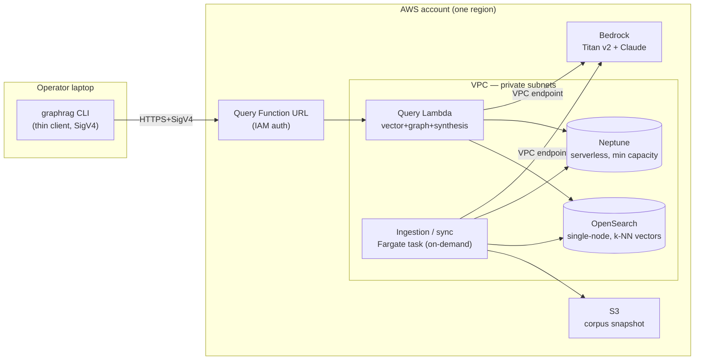
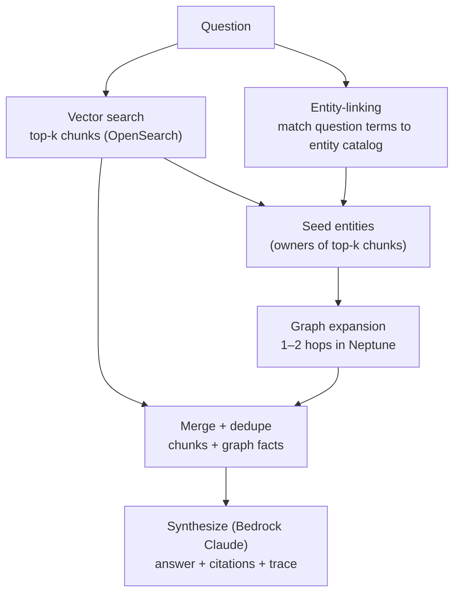

# GraphRAG-on-AWS demo — hybrid orchestration & ephemeral store topology

**Author(s):** (drafted with architect-design)
**Status:** Accepted — decisions recorded in [ADR-0001](../../adr/0001-hybrid-orchestration-seed-and-expand.md) (D1) and [ADR-0002](../../adr/0002-ephemeral-vpc-store-topology.md) (D2)
**Last updated:** 2026-06-23
**Reviewers:** demo maintainer / architecture review (independent design-reviewer pass applied)

## TL;DR

A clone-and-deploy AWS reference that shows when graph-augmented retrieval beats
vector search, over the Kubernetes `community` + `enhancements` corpus. This doc
asks the reader to accept two decisions: **(D1)** a single *seed-and-expand*
hybrid pattern — entities are seeded from both semantic hits *and* entities named
in the question, then expanded in Neptune, merged, and synthesized; and **(D2)**
an **ephemeral, teardown-first** topology — Neptune + OpenSearch in a private VPC,
ingestion on Fargate and a query function in-VPC behind an IAM-auth Function URL,
with one-command deploy *and* destroy.

## Context

Architects evaluating GraphRAG get blog claims, not a runnable, service-by-service
reference. This demo is that reference, across ingestion → retrieval → search, in
three modes (vector / graph / hybrid) plus two enterprise concerns
(permission-filtered retrieval, incremental sync). Product framing, the locked
corpus, and two SURVIVED de-risk verdicts live in
[`docs/product/briefs/graphrag-aws-demo.md`](../../product/briefs/graphrag-aws-demo.md)
and [`docs/product/intents/graphrag-aws-demo.md`](../../product/intents/graphrag-aws-demo.md).
This doc resolves the two architecture decisions those artifacts deferred; it gates
slice 1 (`graph-ingestion-resolution`).

Constraints:

- **AWS-managed-only:** Amazon OpenSearch (vector), Amazon Neptune (graph), Amazon
  Bedrock — Titan Text Embeddings v2 (embeddings) and a Claude model (synthesis).
  *Titan v2 is embeddings-only; answer synthesis needs a generative model.*
- **Non-obvious edge #1 — Neptune is VPC-only.** No public endpoint, so a laptop
  CLI cannot reach it directly. Query and ingestion compute must run *inside the
  VPC*; this shapes the whole topology.
- **Non-obvious edge #2 — neither Neptune nor OpenSearch truly scales to zero.**
  A cloned-and-forgotten demo accrues standing cost. Teardown is a first-class
  feature, not an afterthought.
- **Narratable-live guardrail** (top product guardrail): every ingest→retrieve→
  search step must be explainable on stage; no black-box hop.

## Goals and Non-goals

### Goals

- A reader can stand the demo up on a **clean AWS account with one command** and
  tear it down with one command; no manual console steps.
- The **hybrid query returns a visible trace** naming each seed entity, each graph
  hop, each retrieved chunk, and the final citations — legible enough to narrate.
- **Standing cost while idle is bounded and documented**, and a single `destroy`
  removes every billable resource (verified by a teardown smoke check).
- The same orchestration handles **both** query classes in the curated set:
  semantic-led ("what are the risks of in-place pod resize") and entity-led
  ("summarize the motivations of KEPs the SIG @thockin tech-leads owns").
- Permission-filtered retrieval and incremental re-ingest reuse the **same stores
  and query path** — no parallel pipeline.

### Non-goals

- **Production authorization.** Visibility labels are synthetic and enforced by
  the query function only; this is *not* a real ACL/IAM data-authorization design.
  A reader might assume "permission-filtered retrieval" implies real authz — it
  does not.
- **High availability.** Single-AZ, single-node stores are deliberate; a demo does
  not need multi-AZ failover, and paying for it works against the cost goal.
- **Scale / latency tuning** beyond "demoable" on a corpus of hundreds of docs.
- **Choosing the synthesis Claude model precisely** — see Open Questions.
- **A graphical UI.** The interface is a CLI over the query API.

## Proposal

### D2 — Topology: ephemeral, VPC-resident, thin CLI

**Compute.** Two scale-to-zero compute units keep idle cost off the floor:
- **Ingestion / incremental sync — a Fargate task, run on demand.** Full-corpus
  parse + embed + dual-write can exceed Lambda's 15-minute / memory envelope, so
  Fargate (not Lambda) carries it. It reads a corpus snapshot from S3, parses
  Markdown + YAML, calls Bedrock Titan v2 for embeddings, and writes OpenSearch +
  Neptune. The *same* task in `--delta` mode does incremental sync (below).
- **Query / search — a Lambda in the VPC behind an IAM-auth Function URL.** It runs
  the seed-and-expand orchestration and Bedrock synthesis, and returns the answer
  **plus the trace**. The CLI is a thin SigV4 client. Lambda scales to zero; a
  VPC-attached cold start (ENI attach + first Bedrock/Neptune client init) can be
  multi-second — and since demoability is the #1 attribute, mitigate it on stage
  with a pre-warm smoke call (or provisioned concurrency, accepting the standing
  cost; see Open Questions).

**Stores (cost-first defaults, in private subnets):**
- **Vector — a single-node OpenSearch Service domain with k-NN** (default), not
  OpenSearch Serverless. The rationale is cost shape: a `t3.small.search` node is a
  low fixed monthly cost, whereas AOSS bills a per-OCU floor. **Verify the current
  AOSS minimum-OCU pricing before committing** — the floor has changed over time
  (a lower indexing+search minimum has shipped since the original 4-OCU era), so do
  not assume the old ≈$700/mo figure. If the current floor is materially lower, the
  single-node-vs-AOSS choice becomes a genuine cost-vs-ops tradeoff (see
  Alternatives and Open Questions), not a foregone conclusion.
- **Graph — Neptune Serverless at minimum capacity.** It scales down when idle
  (though **not to zero** — there is a minimum-NCU floor), which fits bursty demo
  use better than a fixed instance, and `destroy` removes the cluster entirely.
  **State the min-NCU standing $/hr in the README** alongside the OpenSearch figure
  (verify both against current pricing) so the "idle cost bounded and documented"
  goal holds for *both* standing-cost stores, not just one.
- **No NAT gateway — reached entirely via VPC endpoints.** This is the deliberate
  "VPC endpoints over NAT" cost choice, but it is only correct if the *full* set of
  endpoints the in-VPC compute needs is provisioned, or deploy on a clean account
  fails with the silent timeouts noted in Risks. Required: `bedrock-runtime`
  (interface), `s3` (gateway — also the corpus-snapshot source), `ecr.api` +
  `ecr.dkr` (interface — Fargate image pull), `logs` (interface — CloudWatch), and
  `sts` (interface — SigV4 / role assumption). Enumerate these in the IaC; the
  post-deploy smoke check must exercise every hop. *(A live `git clone` of the
  corpus from inside the private VPC would need NAT and break this choice — see
  Open Questions; the S3 snapshot is the only no-NAT-consistent source.)*

**Trust boundaries crossed:** laptop → Function URL (IAM/SigV4 — the only public
ingress); query/ingestion compute → stores (IAM + security groups, private
subnets); compute → Bedrock (VPC endpoint, in-region — corpus is public, so egress
is low-sensitivity); retrieved Markdown → Claude (untrusted-content boundary, see
Risks). Blast radius is one account/region; `destroy` is the containment control.

**Lifecycle (IaC).** One stack (CDK or Terraform) with `deploy` and `destroy`.
Deploy provisions VPC + endpoints + stores + compute + Function URL, uploads the
corpus snapshot to S3, and runs the ingestion task once. `destroy` tears down every
billable resource. A post-deploy smoke check runs one hybrid query end-to-end.

### D1 — Hybrid orchestration: one *seed-and-expand* pattern, both directions

**Recommended.** A single orchestration that seeds graph entities from **two**
sources, then expands and synthesizes:

1. **Seed from both sides.** (a) Vector search returns top-k chunks; the entities
   *owning* those chunks (each chunk carries its source doc's entity IDs as
   metadata) become seeds. (b) **Entity-linking** maps terms in the question to
   known entity IDs and adds them as seeds.
2. **Expand** 1–2 hops in Neptune from the seed set to gather structural facts
   (a SIG's chairs, sibling KEPs, ownership edges).
3. **Merge** vector chunks + graph facts (dedupe, order by relevance).
4. **Synthesize** with Claude, returning answer + citations + the seed/hop trace.

**Why this is nearly free here, and why it wins.** The two directions usually fight
for complexity budget: vector-entry→graph-hop is simplest but fumbles entity-led
queries; graph-first→summarize needs entity extraction. But this corpus makes
entity-linking *trivial* — entities are a **controlled vocabulary** (SIG slugs,
`@handles`), so linking is the **same normalized-match + alias table the slice-1
resolver already builds**. Seeding from both sources collapses both query classes
into one pattern at almost no extra cost, and it is the most narratable: the trace
shows exactly which seeds came from semantics vs. the question, and which hops
enriched the answer — directly demonstrating graph *augmenting* vector.

The win is concrete on the two exemplar query classes (expected traces):

- *Semantic-led* — "risks of in-place pod resize": vector finds KEP-1287's Risks
  prose; graph expansion from KEP-1287 adds little; answer is vector-carried.
  Vector-entry-only would also handle this — no regression.
- *Entity-led* — "summarize the motivations of KEPs the SIG @thockin tech-leads
  owns": vector alone retrieves scattered chunks mentioning Thockin and **misses
  the scoping** (it cannot enumerate "all KEPs owned by sig-network"); entity-linking
  seeds `@thockin → sig-network`, graph enumerates the owned KEPs, then semantic
  summarizes their Motivation prose. This is the case vector-entry-only drops.

A watched risk: two seed sources feeding one expansion can **over-expand** and bury
the answer; bound it with a hop limit (1–2) and a seed cap, and surface the seed set
in the trace so over-expansion is visible, not silent.

**Permission-filtered retrieval** rides this path: visibility labels are stored as
OpenSearch doc metadata (a query-time filter) and as Neptune node/edge properties.
The Neptune filter must apply **during traversal, on edges**, not only to the final
nodes — otherwise a forbidden node can still leak via a reachability/hop path even
when it is excluded from the result set. The query function takes a
persona/clearance and applies both filters; the trace shows what was filtered out.

**Incremental sync** is the Fargate task in `--delta` mode: it diffs the ingested
commit against a new corpus snapshot, then upserts/deletes by a stable key
(doc path + content hash), re-resolving entities for changed docs and removing
orphaned chunks/nodes. Both stores are written in one task for consistency; a
`--rebuild` escape hatch reingests from scratch.

## Alternatives Considered

### Vector-entry → graph-hop only (one direction)

The canonical GraphRAG flow: semantic search seeds, graph expands, synthesize. The
simplest pattern and a clean story.

**Rejected because:** it under-serves the entity-led half of the curated query set
("all KEPs the SIG @thockin tech-leads owns") — those name an entity directly and
benefit from graph-first scoping. Since entity-linking is nearly free on this
controlled-vocabulary corpus, dropping it forfeits real query coverage to save
almost no complexity.

### Parallel-retrieve → merge-at-synthesis (independent modes)

Run vector and graph fully independently, merge both context sets at synthesis.
Robust to either mode missing.

**Rejected because:** graph needs *some* seed to query — without entity-linking it
either runs templated queries or nothing, so "independent" graph retrieval is
illusory for free-text questions. Seed-and-expand keeps the independence that
matters (two seed sources) without pretending the graph can query itself blind.
*(Note: the slice-3 comparison runner still executes vector-only and graph-only
independently for side-by-side contrast — that's the demo's pedagogy, distinct
from the hybrid mode's internal orchestration.)*

### OpenSearch Serverless instead of a single provisioned node

Less operational surface, no node/version management.

**Rejected because:** a per-OCU floor is the wrong cost shape for an ephemeral,
teardown-first demo versus a low fixed-cost single node — *conditional on current
AOSS minimum-OCU pricing*, which has dropped since the original 4-OCU era and must
be re-checked (see Open Questions). If the floor is now close to the single-node
cost, this rejection weakens and AOSS becomes the better pick on ops simplicity.
Either way, kept as the recommended swap for anyone who wants persistent/managed ops
over cost.

### Single in-VPC "demo box" (EC2/Fargate runs CLI + orchestration) — Shape B

One box in the VPC runs everything; SSH in and run the CLI. Simplest to reason
about, cheapest when stopped.

**Rejected because:** it hides the managed-services story this demo exists to
teach (the architect wants to see OpenSearch/Neptune/Bedrock wired as services,
not a script on a box) and the in-VPC console flow is less reproducible than a
thin local CLI + IaC. Recorded as the fallback if VPC-Lambda networking proves too
fiddly.

## Risks

- **Cost footgun — standing Neptune/OpenSearch.** A user clones, deploys, forgets.
  *Mitigation:* teardown-first IaC with one-command `destroy`; min-capacity stores;
  a deployed **AWS Budgets alarm** and a prominent README cost note; the
  smoke-check output prints the running cost estimate and the destroy command.
- **Operational (3am) — VPC networking misconfig breaks the query path.** Lambda
  in a VPC reaching Neptune, OpenSearch, and a Bedrock VPC endpoint is the most
  failure-prone wiring (security-group rules, endpoint DNS, subnet routing). A
  silent SG mistake yields timeouts, not clear errors. *Mitigation:* IaC encodes
  SG rules and endpoints; the post-deploy smoke check fails loudly with a
  diagnostic if any hop is unreachable; document the three hops explicitly.
- **Entity-linking misseeds.** A question term matches the wrong entity, seeding a
  misleading graph expansion. *Mitigation:* reuse the slice-1 resolver/alias table;
  surface every seed in the trace so a misseed is visible on stage, not hidden.
- **Prompt injection from retrieved Markdown.** KEP/charter text is untrusted input
  to Claude (OWASP LLM01/LLM08). *Accepted, boundary named:* the corpus is public
  and benign, output is **display-only** (no tool execution → no agentic action),
  and the instructions-vs-retrieved-data boundary is documented. Control-level
  verification routes to `security-reviewer` if the demo ever ingests private data.
- **No store HA (single-AZ/single-node).** *Accepted unmitigated:* a demo does not
  need failover; restated as a Non-goal so a reader doesn't mistake it for an
  oversight.
- **Incremental drift / orphans.** A delta sync leaves stale nodes or chunks.
  *Mitigation:* content-hash keys + an explicit delete pass; `--rebuild` escape
  hatch as the ground-truth reset.

## Rollout

This is a **template**, not a running service, so "rollout" is the deploy/teardown
lifecycle plus slice sequencing.

- **Shape:** phased by the brief's Spec map — slice 1 (`graph-ingestion-resolution`)
  stands up VPC + Neptune + ingestion + graph query; slice 2 adds OpenSearch +
  vector; slice 3 adds the query Lambda's hybrid path + comparison runner; slices
  4–5 add label filtering and delta sync. Each slice deploys behind the same IaC
  stack.
- **Rollback:** `destroy` + redeploy. State is fully reproducible from the corpus
  snapshot in S3, so there is **no data migration and no irreversible step**.
- **On the hook:** the demo maintainer owns the deploy/teardown window and the
  cost alarm.

## Open Questions

- **Which Claude model for synthesis?** Trade cost/latency vs. answer quality at
  demo scale. *Answerable by:* a short Bedrock cost/latency comparison on the
  curated query set (see the `claude-api` skill for current Bedrock model IDs and
  pricing — do not assume from memory).
- **AOSS vs. single-node OpenSearch — final pick.** *Answerable by:* re-pricing the
  **current AOSS minimum-OCU floor** (it has dropped since the 4-OCU era — verify,
  don't assume) and comparing to the single-node monthly cost at corpus scale. If
  the floor is now close, this flips to a real ops-vs-cost tradeoff rather than a
  default.
- **Corpus snapshot strategy — pin a commit vs. live `git clone`.** *Constrained,
  not free:* a live clone from inside the private VPC needs NAT, which contradicts
  the no-NAT cost posture (D2). So the no-NAT-consistent option is an **S3 snapshot**
  (pinned commit) — reproducible *and* the source the topology already assumes. A
  small hand-authored delta on top gives the incremental-sync demo its freshness
  without reintroducing NAT. Effectively decided unless the maintainer accepts NAT.
- **Live-demo cold-start mitigation — pre-warm vs. provisioned concurrency.**
  *Tradeoff:* a pre-warm smoke call is free but manual; provisioned concurrency is
  reliable but adds standing cost (against driver #2). The presenter's call, by
  how much on-stage latency they'll tolerate.
- **Single-AZ vs. multi-AZ for the demo.** Pure cost-vs-realism; the presenter's
  call.

## Appendix — by-construction pillar map (AWS)

| Pillar | How it's met (demo posture) |
|---|---|
| Reliability | Managed Neptune/OpenSearch; single-AZ by choice (Non-goal); rebuild-from-snapshot is the recovery path. |
| Security | Private subnets, IAM + SigV4 ingress, VPC endpoints (no NAT), in-region Bedrock; synthetic labels are *not* real authz. |
| Cost | Scale-to-zero compute (Lambda + on-demand Fargate); min-capacity stores; VPC endpoints over NAT; teardown-first + Budgets alarm. |
| Performance | Demo-scale corpus; cold-start tolerated; k-NN + 1–2-hop traversal bounded. |
| Operational excellence | One-command deploy/destroy; post-deploy smoke check; retrieval trace doubles as the observability surface; CloudWatch logs. |
| Sustainability | Idle cost ≈ idle resource use; ephemeral teardown avoids always-on waste. |
