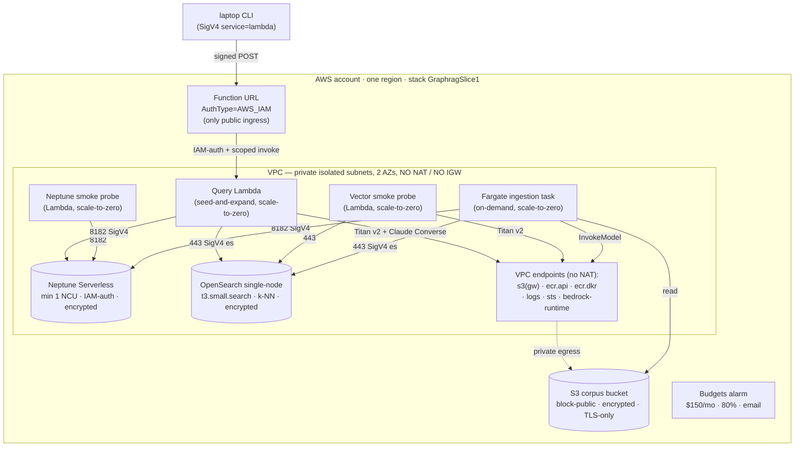

# Infrastructure lens

> **The rolled-up, current-state view of the demo's AWS infrastructure** — what is
> provisioned today, how it fits together, what it costs idle, and the cross-cutting
> infra patterns the template teaches. **Living doc:** updated in the same PR as any
> infra change, and *enhanced* as each slice adds infrastructure (see the
> [Evolution log](#evolution-log)).
>
> This is the **lens** (the snapshot + the why-it's-shaped-this-way), not the
> mechanics. It **cites, never copies**:
> - *Why* these choices → [ADR-0002](../adr/0002-ephemeral-vpc-store-topology.md)
>   (topology), [ADR-0003](../adr/0003-iac-tool-aws-cdk-python.md) (CDK), and the
>   [design doc § D2](graphrag-aws-architecture/design.md).
> - *How to deploy / tear down / verify* →
>   [`deployment-and-verification.md`](deployment-and-verification.md).
> - *Security posture* of the same resources → [`security.md`](security.md).
> - *Deploy-time gotchas* (the residue) → `docs/knowledge/patterns.jsonl` (the
>   `apps/infra/**`-scoped `K-00NN` entries), surfaced here only as a class.

One CDK app (`apps/infra/`, stack `GraphragSlice1`) provisions everything below.
Scope is "demoable on hundreds of docs"; HA, scale, and latency tuning are explicit
non-goals (ADR-0002).

## Topology snapshot

## Resource inventory (slices 1–3)

### Network — the no-NAT, endpoints-only spine
- **VPC**, **2 AZs** (a Neptune DB subnet group requires ≥2 AZs — an API rule, not
  HA; subnets are free), **private isolated subnets only**, **no NAT gateway, no
  internet gateway**. All egress rides VPC endpoints.
- **VPC endpoints** (the set is part of the ADR-0002 decision, not an impl detail):
  `s3` (gateway), `ecr.api`, `ecr.dkr`, `logs`, `sts`, `bedrock-runtime` (interface).
- **Security groups** — least-path: `IngestionSg → Neptune:8182` and `→ OpenSearch:443`;
  `NeptuneSmokeSg → Neptune:8182`; `VectorSmokeSg → OpenSearch:443`;
  `QuerySg → Neptune:8182` and `→ OpenSearch:443`. No public *network* ingress; the
  query Lambda's only public surface is its **IAM-auth Function URL** (slice 3), and
  its SG keeps the no-egress (VPC-endpoint-only) guarantee.

### Stores — the standing-cost floor (do **not** scale to zero)
| Store | Shape | Posture |
| --- | --- | --- |
| **Neptune Serverless** | min 1 / max 2.5 NCU, single instance | IAM-auth, storage-encrypted, VPC-private (no public endpoint) |
| **OpenSearch** | single-node `t3.small.search`, 10 GB gp3 | encryption-at-rest + node-to-node + enforce-HTTPS, VPC-private, **not public**, access policy scoped to the task + probe roles |
| **S3 corpus bucket** | — | block-public, encrypted, TLS-only, `DESTROY` + auto-delete |
| **ECR repo** (ingestion image) | — | `DESTROY` + empty-on-delete |

### Compute — scale-to-zero (idle cost ≈ $0)
- **Fargate ingestion task** (512 CPU / 1024 MiB) — on-demand; single-parse
  dual-writes Neptune + OpenSearch.
- **Neptune smoke probe** + **vector smoke probe** — in-VPC Python 3.12 Lambdas,
  invoked on demand, no public URL.
- **Query Lambda** (slice 3) — in-VPC Python 3.12 Lambda running seed-and-expand
  (`graphrag.query_lambda`), behind an **IAM-auth Function URL**; scale-to-zero, no
  hourly URL charge, Bedrock Claude billed per-invocation only.
- **ECS cluster** — no standing cost without a running task.

### IAM — least privilege, scoped, no wildcard `Resource`
| Role | Grants (all resource-scoped) |
| --- | --- |
| Ingestion task role | `s3` read (corpus bucket), `neptune-db:*` data actions (this cluster), `es:ESHttp*` (this domain), `bedrock:InvokeModel` (the one Titan model) |
| Vector probe role | VPC-access managed policy, `es:ESHttp*` (this domain), `bedrock:InvokeModel` (Titan) |
| Neptune probe role | `neptune-db:*` data actions (this cluster) |
| **Query Lambda role** (slice 3) | VPC-access managed policy; `neptune-db:*` data actions (this cluster); `es:ESHttp*` (this domain); `bedrock:InvokeModel` (Titan) + `bedrock:InvokeModel`/`bedrock:Converse` (the synthesis Claude — the **inference-profile ARN AND each underlying regional foundation-model ARN**) — no wildcard `Resource` |
| ECS execution role | ECR pull + logs (`ecr:GetAuthorizationToken` is the one legitimate `"*"`) |

The Function URL is `AuthType=AWS_IAM` (the only public ingress) **and** its invoke
permission is scoped to a named principal — the `InvokerRoleArn` CfnParameter (the
deploying/CLI role) — never `Principal: *`/account-root. IAM auth gates *that a request
is signed*; the scoped grant gates *who may invoke*.

The OpenSearch SigV4 signing service and the IAM `es:ESHttp*` prefix come from a
**single `"es"` constant** (`store/opensearch.py`) so they can't drift.

### Guardrails & governance
- **AWS Budgets alarm** — `$150/mo`, alerts at 80%, email subscriber (re-evaluated
  for the two standing stores + the interface endpoint).
- **Five governance tags** (`Environment`, `Project`, `Department`, `Application`,
  `User`) propagated to every taggable resource.

## Standing (idle) cost posture

The teardown-first reason this matters: a cloned-and-forgotten stack bills for the
two stores even while idle. Order-of-magnitude, **verify against current pricing**
(it drifts — the design doc makes the same caveat):

| Resource | Idle cost | Scales to zero? |
| --- | --- | --- |
| Neptune Serverless (min NCU floor) | the dominant idle line | no (min-NCU floor) |
| OpenSearch `t3.small.search` + 10 GB EBS | a low fixed monthly | no |
| `bedrock-runtime` interface endpoint | hourly per-AZ | no |
| NAT gateway | **$0 (none provisioned)** | n/a |
| Fargate / Lambda / ECS | ~$0 idle | yes |
| Query Lambda + Function URL (slice 3) | **$0 idle** (no hourly URL charge; Claude per-invocation) | yes |

Controls: one-command `cdk destroy` removes every billable resource; the Budgets
alarm + the README cost note are the cloned-and-forgotten backstop.

## Cross-cutting infra patterns (the lens)

The reusable infra approaches this template demonstrates — each an adopter
consideration, with where it's decided:

1. **Ephemeral, teardown-first.** Every billable resource is `DESTROY`-removable;
   one `destroy` leaves nothing. → ADR-0002.
2. **No-NAT, VPC-endpoints-only egress.** The exact endpoint set is a decision, and
   a missing endpoint fails as a silent timeout — so the post-deploy probes exercise
   every hop. → ADR-0002.
3. **Scale-to-zero compute vs. always-on stores.** Lambda (query/probe) + on-demand
   Fargate (ingest) keep the idle floor to the two managed stores only.
4. **Single-node / min-capacity stores.** Cost over HA (a named non-goal); subnets
   span 2 AZs only because an API demands it, not for failover.
5. **IAM-mediated data plane.** SigV4 to Neptune (`neptune-db`) and OpenSearch
   (`es`); least-privilege roles scoped to specific resource ARNs; resource-side
   policies (the OpenSearch domain access policy) back the identity-side grants.
6. **Probe-based live verification.** Each VPC-private store gets a scale-to-zero
   in-VPC probe Lambda that does a real write→read round-trip through the *same*
   adapter the app uses — the only honest proof the live wiring works.
   → [`deployment-and-verification.md`](deployment-and-verification.md).
7. **Clean-account prerequisites baked into the deploy.** `cdk bootstrap` and the
   OpenSearch service-linked role are handled by `scripts/deploy.sh`, so
   "one-command deploy on a clean account" actually holds.

## Deploy-time lessons (a class, detailed in the knowledge base)

Synth (`cdk synth` + `Template` assertions) catches topology and security-config
shape, but a recurring class of failures surfaces **only at deploy time** and is
captured as `apps/infra/**` knowledge entries (`docs/knowledge/patterns.jsonl`):
service-linked-role prerequisites, subnet-group AZ minimums, reserved env vars,
EC2 description charsets, and CDK's habit of expressing some controls (e.g. a VPC
OpenSearch access policy) via a custom resource rather than an inline property. The
standing rule that falls out: **run the real `cdk synth` CLI and do at least one
live deploy+probe+destroy** before trusting an infra change — synth alone is
necessary, not sufficient.

## Evolution log

Append one entry per slice that touches infrastructure. Newest first.

- **Slice 2 — `vector-rag-baseline` (2026-06-24).** Added to the same stack: the
  `bedrock-runtime` VPC endpoint; a single-node, VPC-private, encrypted **OpenSearch
  domain** (k-NN) with a role-scoped access policy; a **vector smoke probe** Lambda;
  scoped `es:ESHttp*` + `bedrock:InvokeModel` on the task + probe roles; the Fargate
  **single-parse dual-write** (graph + vector); the Budgets limit raised `$50 → $150`
  for the second standing store; and the **OpenSearch service-linked role** as a
  deploy prerequisite (now created idempotently by `deploy.sh`). **Live-verified**
  end-to-end (deploy → vector probe `{"ok": true}` → destroy) on 2026-06-24.
- **Slice 1 — `graph-ingestion-resolution`.** Stood up the spine: no-NAT VPC + the
  `s3`/`ecr.api`/`ecr.dkr`/`logs`/`sts` endpoints; **Neptune Serverless**; the S3
  corpus bucket; the **Fargate ingestion** task + least-privilege role; the
  **Neptune smoke probe**; the Budgets alarm; governance tags.

- **Slice 3 — `hybrid-orchestration` (2026-06-24).** Added to the same stack: the
  in-VPC **query Lambda** (`graphrag.query_lambda`, private isolated subnets, no
  egress) behind an **IAM-auth Function URL** (`AuthType=AWS_IAM`, the only public
  ingress) whose invoke permission is scoped to a named principal (the `InvokerRoleArn`
  CfnParameter); the query Lambda role gains scoped Neptune-data + OpenSearch-data +
  Bedrock-invoke (Titan + the synthesis **Claude** — the cross-region inference-profile
  ARN **and** the underlying regional foundation-model ARNs, no wildcard); a
  stack-managed log group; an SG path to Neptune 8182 + OpenSearch 443; the Function
  URL `CfnOutput`. **No new standing cost** — the Lambda is scale-to-zero, so the
  Budgets limit holds at **$150**. The CDK `_SYNTHESIS_MODEL_ID` is asserted equal to
  the library `DEFAULT_SYNTHESIS_MODEL_ID` so the grant scope and runtime default can't
  drift. Live smoke is the supervisor's step (AC9).

### Planned (not yet built)
- **Slices 4–5** (permission-filtered retrieval, incremental delta re-ingest) — no
  new infra expected; they reuse the stores and the query path.
