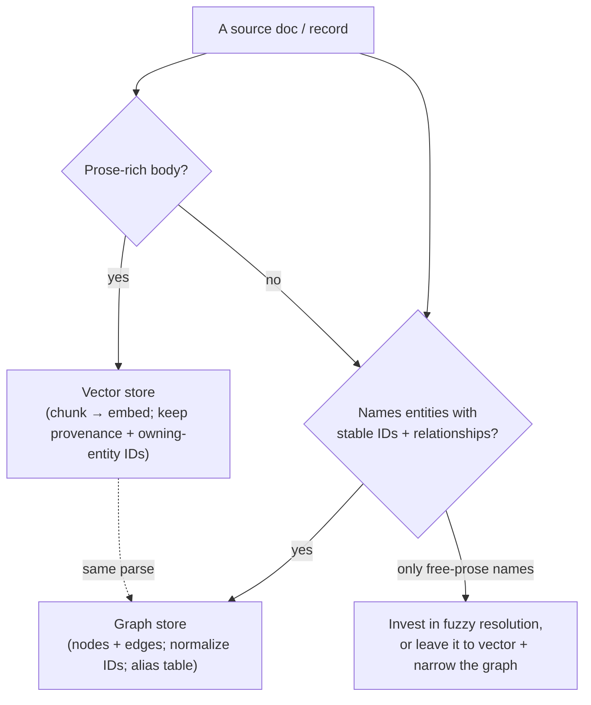

# About choosing what to ingest, and how to slice your corpus

> Why a GraphRAG pipeline routes some of your data to a vector store, some
> to a graph, and some to both — and how those choices, made at ingest,
> decide which questions it can later answer. This page is for understanding
> the model, not for running the demo. To see it in action, work the
> [three-mode demo tutorial](../tutorials/three-mode-demo.md); for the
> commands, that tutorial carries them.

## The question this page answers

A team evaluating GraphRAG keeps asking one question in different words:
*will a knowledge graph actually beat plain vector search on my data?* The
honest answer is "it depends on your questions" — and what most people miss
is that the dependency is set much earlier than query time. It's set at
**ingest**, when you decide what becomes an embedded chunk, what becomes a
graph node or edge, and what gets dropped. Ingestion is lossy by choice;
what you don't extract, no retrieval mode can return. So the real question
is: *given my corpus and the questions I need to answer, how do I slice and
route the data so the graph can earn its keep?* This page gives you the
mental model to decide.

## The shape of the answer

Start by sorting your sources not by *file type* but by *where the answer
lives* in them.

Some data carries its answer in **prose** — the meaning is in the words.
Design docs, charters, READMEs, runbooks, wiki pages, the description field
of a ticket. A human answers a question about this material by *reading a
passage*. That is exactly what semantic search is good at, so this content
becomes embedded chunks in the vector store.

Other data carries its answer in **structure** — named entities and the
relationships between them. A `sigs.yaml`, an ownership manifest, a
CODEOWNERS file, an org chart, an API spec, any table. A human answers a
question about this material by *cross-referencing a list or hierarchy*, not
by reading prose. That is what a graph is for, so this content becomes nodes
and edges.

Most real documents are **mixed**: a prose body plus structured frontmatter
or a meaningful path. A Kubernetes KEP README is the canonical case — its
prose is worth embedding, while its directory path and frontmatter tell you
which SIG owns it. Mixed sources feed *both* stores, and the demo writes
them in a single parse so the two views can never drift (the charter calls
this single-parse dual-write).

The litmus test is quick: *could a reader answer this by reading one
passage, or must they consult a list, table, or hierarchy?* The first
belongs to vector; the second to the graph.

The dotted line matters as much as the boxes: one read of each source feeds
both stores, so a chunk and the graph node it belongs to always agree.

### The predictor that decides whether the graph pays off

The single biggest signal isn't the size of your corpus or the cleverness of
your embeddings — it's whether your **entities have stable identifiers**. The
demo's graph resolves entities mechanically: it normalizes a mention to a
canonical id and merges anything that lands on the same id, with a small
hand-authored alias table for the few prose-name-to-handle cases. That works
because Kubernetes SIG slugs and GitHub `@handles` are a *controlled
vocabulary* — `@thockin` is always `@thockin`.

If your entities have that shape — slugs, handles, ticket keys, URNs — graph
construction is cheap and, just as important, *narratable*: every merge is
explainable as "these two rows produced the same id," with no trained model
to second-guess. If instead your entities are only named in free prose ("the
platform team", "Tim's group"), resolution turns into fuzzy matching or NER,
and the graph's value drops sharply unless you invest there. The honest move
in that case is to narrow the graph to the entities you *can* resolve well,
and let vector search carry the rest.

### Slicing is choosing which questions you can answer

Because ingestion is lossy, the slice you take is a commitment. Three
consequences are worth holding in mind:

- **Embed the prose, not the tables.** A config table embedded as text
  pollutes semantic recall; it belongs in the graph. Keep the vector store
  to the prose-rich subset.
- **An entity-led question is only answerable if you emitted the edge.**
  "Which proposals does this team own?" needs an `OWNS` edge to exist in the
  graph. List the entity-led questions you must serve, then make sure every
  relationship they traverse is something you extract — not something you
  hope to infer later.
- **The join between the two stores is a shared id.** What makes *hybrid*
  retrieval more than two separate searches is that each embedded chunk
  carries the ids of the entities it belongs to, byte-for-byte identical to
  the graph's node ids. That shared key is what lets a semantic hit jump into
  the graph and expand. Drop it, and hybrid degrades to two disconnected
  indexes.

## Design choices and tradeoffs

The demo could have embedded everything and skipped the graph — the common
"just use vector RAG" path. It doesn't, because a pile of embedded chunks
cannot *enumerate* a set ("all KEPs owned by sig-network") or *scope* an
answer by a relationship; it can only surface text that looks similar. The
graph exists precisely for the questions vector search fumbles, and the cost
of building it is low *only* because the corpus has stable entity ids — which
is why that property, not raw corpus size, is the decision driver.

It could also have kept the two stores in separate pipelines. Instead it
parses each source once and writes both, trading a little ingest-time
coupling for a guarantee the stores never disagree. And it resolves entities
with normalization plus a tiny alias table rather than a model, trading some
recall on messy prose names for a resolution step a presenter can explain on
a slide. The binding rationale for the seed-and-expand retrieval these
choices serve is recorded in
[ADR-0001](../../adr/0001-hybrid-orchestration-seed-and-expand.md); the
ordered considerations a team re-decides for its own corpus are the
*Architecture patterns* spine in [the charter](../../CHARTER.md).

## How this differs from plain vector RAG

Plain vector RAG makes one ingest decision: chunk and embed. It answers
semantic-led questions well and entity-led questions poorly, and it can't
tell you which kind you have until you ask. The model on this page adds a
second decision — *what is structure, and does it have stable ids?* — and
routes accordingly. The payoff isn't "graph instead of vector"; it's that
the slice you take at ingest is what lets the same question be answered by
the right mode, and lets the hybrid path use both. The
[three-mode demo](../tutorials/three-mode-demo.md) shows the same question
diverging across vector / graph / hybrid so you can feel where each wins.

## See also

- [Three-mode demo](../tutorials/three-mode-demo.md) — run vector / graph /
  hybrid side by side and watch the divergence.
- [Project charter — Architecture patterns](../../CHARTER.md) — the ordered
  considerations (corpus & resolution, single-parse dual-write) a team
  re-decides for its own context.
- [ADR-0001 — seed-and-expand hybrid](../../adr/0001-hybrid-orchestration-seed-and-expand.md)
  — the team's record of *why* the hybrid retrieval is shaped this way.
