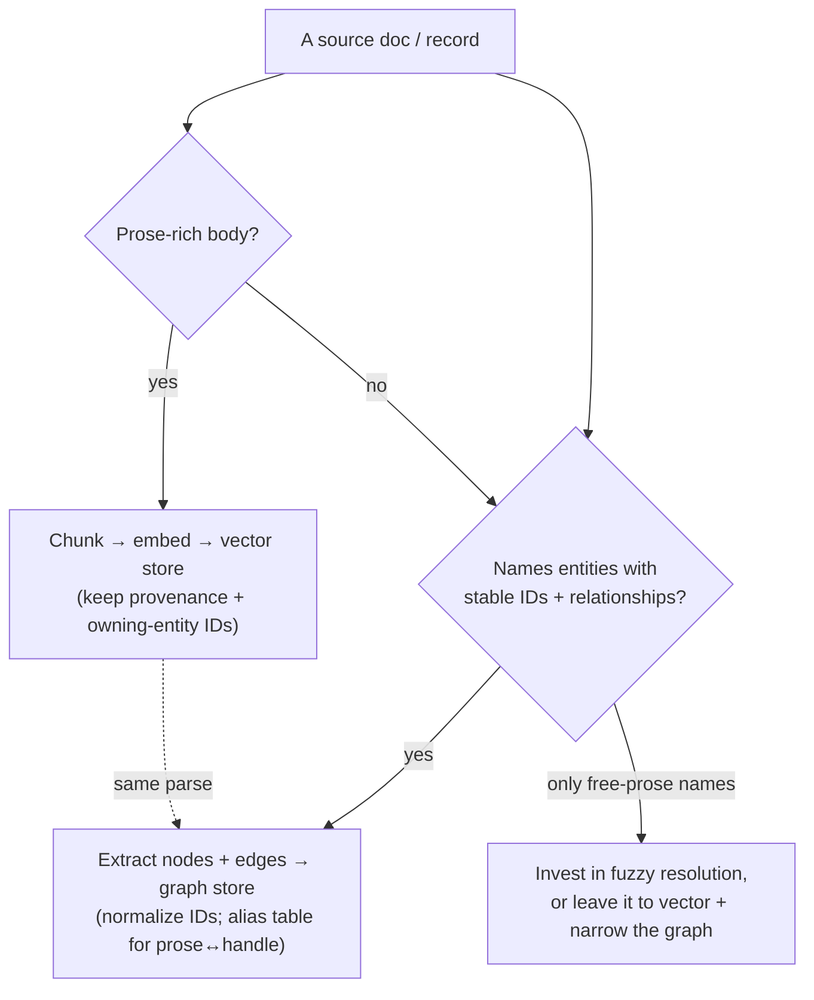

# Three-mode demo — presenter script

The payoff of the GraphRAG-on-AWS demo: on one question, show how **vector-only**,
**graph-only**, and **hybrid** retrieval diverge — and *why* the hybrid answer is
better when it is. This script walks a presenter through the consolidated showcase set
with the exact CLI commands and what to point at in each trace.

- **Queries:** `packages/graphrag/src/graphrag/showcase/queries.yaml` (loaded by
  `graphrag.showcase.load_showcase`). Each query is labeled with the mode it should
  *win*, its gold entity/chunk ids, and a one-line highlight.
- **Offline by default:** every command below runs against the bundled fixture corpus
  with the in-memory stores + the offline **non-semantic** embedder/synthesizer — so it
  is reproducible and credential-free. The CLI prints a `NON-SEMANTIC` banner so the
  audience is never misled: the structural graph/hybrid win is real offline; the
  *semantic* win is shown live (the `--function-url` / `--bedrock` path) and by the
  slice-2 frozen-vector eval.
- **The trace is the pedagogy** (charter principle 1): every verb prints an ordered
  **seeds-by-source → hops → citations → answer** trace. Point at it; there is no
  black-box hop.

Set the corpus paths once:

```bash
CORPUS=packages/graphrag/tests/fixtures/corpus
COMMUNITY=$CORPUS/community
ENHANCEMENTS=$CORPUS/enhancements
```

## Act 1 — vector wins (semantic, no entity to seed)

A paraphrased, prose-rich question with no named entity. Vector retrieves the right
KEP chunk by meaning; the graph has nothing to seed from.

```bash
graphrag compare --community "$COMMUNITY" --enhancements "$ENHANCEMENTS" \
  --q "How does service internal traffic policy keep traffic node-local?"
```

**Point at:** the `vector-only` block surfaces the KEP-2086 README chunk
(`enhancements/keps/sig-network/2086-service-internal-traffic-policy/README.md#0`); the
`graph-only` block has no question seed, so its expansion is empty. This is the honest
"vector is the right tool here" case (showcase id `vec-traffic-policy`).

## Act 2 — graph wins (entity-led, multi-hop structure)

The question names an entity and asks for a *relationship* across hops — exactly what
prose similarity cannot enumerate.

```bash
graphrag compare --community "$COMMUNITY" --enhancements "$ENHANCEMENTS" \
  --q "Which KEPs does the SIG @thockin tech-leads own?"
```

**Point at:** in `graph-only` and `hybrid`, the hop trace expands
`person:thockin -TECH_LEADS-> sig:sig-network -OWNS-> {kep-1880, kep-2086}` (a 2-hop
path, so `--max-hops 2`), and the result set **enumerates the owned KEPs**. The
`vector-only` block does **not** enumerate that owned set — it has no edges to follow.
This is the structural demonstration that graph augments vector (showcase id
`graph-thockin-owned-keps`).

Run `graphrag hybrid-query` on the same question to see the **dual-seed** split up
close:

```bash
graphrag hybrid-query --community "$COMMUNITY" --enhancements "$ENHANCEMENTS" \
  --q "Which KEPs does the SIG @thockin tech-leads own?"
```

**Point at:** `seeds: question: person:thockin` (the `@handle` linked from the
question — note it resolves to the **person**, not the SIG) alongside the
`seeds: vector:` owners of the top-k chunks; then the hops; then citations; then the
answer.

## Act 3 — hybrid wins (semantic question, graph join)

A semantic question whose *answer* needs the graph join: the question seeds an entity,
vector seeds the relevant prose, and the merge lands the precise result.

```bash
graphrag compare --community "$COMMUNITY" --enhancements "$ENHANCEMENTS" \
  --q "Of the KEPs the SIG @thockin tech-leads owns, which one keeps traffic node-local?"
```

**Point at:** `hybrid` seeds `person:thockin` from the question *and* the
traffic-policy chunk from vector, expands to the owned KEPs, and the merged context
lets the synthesizer land **KEP-2086** — neither pure mode gets there as cleanly
(showcase id `hybrid-thockin-traffic`).

## Live path (semantic, real Bedrock Claude)

The offline synthesizer is non-semantic by design. To show the real round trip,
target the deployed in-VPC query Lambda behind its **IAM-auth Function URL** (the CLI
signs the request SigV4, `service=lambda`, signature covering the body):

```bash
graphrag hybrid-query --community "$COMMUNITY" --enhancements "$ENHANCEMENTS" \
  --function-url "$(aws cloudformation describe-stacks --stack-name GraphragSlice1 \
      --query "Stacks[0].Outputs[?OutputKey=='QueryFunctionUrl'].OutputValue" --output text)" \
  --q "Which KEPs does the SIG @thockin tech-leads own?"
```

The deploy + live smoke is recorded in
[`docs/architecture/deployment-and-verification.md`](../../architecture/deployment-and-verification.md).

## From the demo to your own corpus — what to ingest, and how to slice it

The demo's thesis is that **whether a knowledge graph earns its keep depends on your
query shapes**, and your query shapes are bounded by **how you slice and route your
data at ingest** — what you don't extract, no retrieval mode can return. Before
cloning the pipeline onto your own data, work these decisions in order.

### Step 1 — Decide per *data shape*, not per file

Sort each kind of source by asking *what carries the answer*:

| Data shape | Examples | Answer lives in… | Route to |
| --- | --- | --- | --- |
| **Prose-rich** | design docs, charters, READMEs, runbooks, wiki pages, ticket/PR descriptions | meaning in free text | **vector** (chunk → embed → k-NN) |
| **Structure-rich** | YAML/JSON config, ownership manifests, org charts, frontmatter, CODEOWNERS, API specs, tables | named entities + their relationships | **graph** (extract nodes/edges) |
| **Mixed** (the common case) | a doc with a prose body *and* structured frontmatter / a known path | both | **both**, in one parse (single-parse dual-write) |

The demo corpus is exactly this split: `sigs.yaml` / `kep.yaml` are structure-rich
(→ graph: SIG / Person / KEP nodes + `CHAIRS` / `OWNS` / `APPROVES` edges); the SIG and
KEP `README.md` bodies are prose-rich (→ vector chunks); and a KEP README is *mixed* —
its prose is embedded while its path + frontmatter contribute the **owning-entity IDs**
that join it to the graph.

> **Litmus test:** *Could a human answer this by reading one passage, or must they
> cross-reference a list / table / hierarchy?* The first is vector's job; the second is
> the graph's.

### Step 2 — Pick your entities, and check they have stable IDs

The graph is only as good as the entities you can resolve. For each candidate entity
type (team, person, service, decision, component…):

- **Stable, controlled-vocabulary ID** (a slug, a handle, a ticket key, a URN)? Then
  resolution is **mechanical** — normalize to a canonical ID + a small hand-authored
  alias table, exactly as `normalize.py` + `aliases.yaml` do here. Cheap, and narratable
  (no trained model).
- **Only named in free prose** ("the platform team", "Tim's group")? Then resolution is
  **hard** — you need fuzzy matching / NER, and the graph's value drops unless you invest
  there. The honest move is to **narrow the graph to the entities you can resolve well**
  and let vector carry the rest.

This is the single biggest predictor of whether graph mode pays off on your corpus. The
K8s corpus was chosen *because* SIG slugs and GitHub `@handles` are a controlled
vocabulary; yours may not be so lucky — decide with eyes open.

### Step 3 — Slice for the questions you must answer

Ingestion is lossy by choice:

- **Embed the prose-rich subset only.** Don't embed a config table — graph it. Structured
  dumps and boilerplate pollute k-NN recall.
- **Extract the edges your entity-led questions need.** "Which KEPs does this SIG own?" is
  answerable *only* because the `OWNS` edge was emitted at ingest. List your target
  entity-led questions first, then ensure every relationship they traverse is an edge you
  emit.
- **Keep the join key on every chunk.** Each embedded chunk carries its provenance
  (source, path, heading) **and its owning-entity IDs, byte-identical to the graph node
  IDs** — that shared ID is what lets seed-and-expand jump from a vector hit into the
  graph. Skip it and hybrid degrades to two disconnected stores.
- **Chunk heading-aware, bounded + overlapping** — so a hit is a coherent passage and the
  trace stays legible.

### The routing decision, in one picture



The dotted line is the **single-parse dual-write**: one read of each source feeds both
stores from the same pass, so they can never drift (charter pattern 2).

### Where the deeper reasoning lives

This is the *Corpus & cross-source entity resolution* and *Single-parse dual-write*
spine of the project. The ordered considerations + trade-offs are in
[`docs/CHARTER.md` § Architecture patterns](../../CHARTER.md), the seed-and-expand
rationale in [ADR-0001](../../adr/0001-hybrid-orchestration-seed-and-expand.md), and the
concrete parse → extract → resolve code in `packages/graphrag/`.

## The showcase set at a glance

| Mode | Showcase ids |
| --- | --- |
| vector | `vec-traffic-policy`, `vec-multiple-cidrs`, `vec-in-place-resize`, `vec-node-allocatable`, `vec-network-charter`, `vec-node-charter` |
| graph | `graph-thockin-owned-keps`, `graph-network-owns`, `graph-node-owns`, `graph-kep-1287-approvers`, `graph-network-leaders`, `graph-network-subprojects` |
| hybrid | `hybrid-thockin-traffic`, `hybrid-network-cidr-detail`, `hybrid-node-resize-owner`, `hybrid-network-charter-keps`, `hybrid-thockin-role`, `hybrid-node-allocatable-owner` |

Each row's `query`, `gold`, and `highlight` live in `queries.yaml`; a test
(`test_showcase.py`) asserts every gold id resolves in the fixture corpus, so the
curation stays honest.
