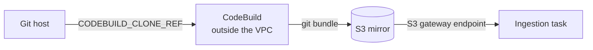
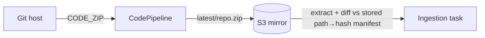
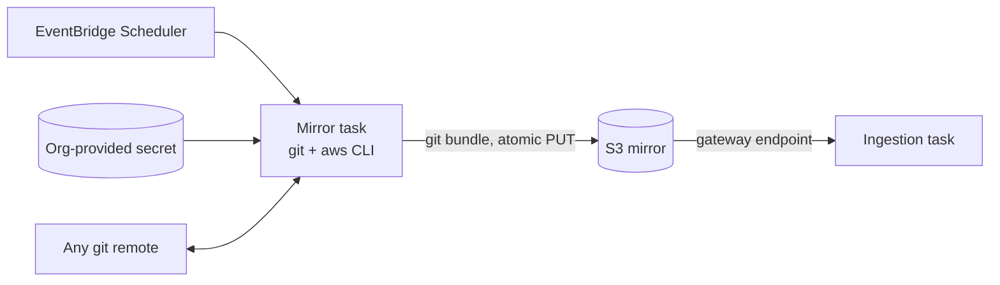

# RFC-0005: Git repository acquisition mechanism

- **Status:** Open — candidates listed, **no decision made**
- **Author:** eugenelim
- **Approver:** TBD
- **Date opened:** 2026-09-21
- **Date closed:** —
- **Related:** [ADR-0016](../adr/0016-git-ingestion-commit-sha-delta-medallion.md) (the decision this revisits — §2 only); [ADR-0002](../adr/0002-ephemeral-vpc-store-topology.md) (no-NAT egress posture); [ADR-0011](../adr/0011-neptune-sparql-rdf-engine-and-text2sparql-guard.md) (`ingestion_task_role` write grant); [RFC-0004 §D6](0004-biz-ops-kg-pivot.md) (git commit-SHA delta + medallion); [RFC-0002](0002-ingestion-pattern-axis.md) (ingestion as a first-class pattern axis); [`architecture/biz-ops-knowledge-graph/ingestion.md`](../architecture/biz-ops-knowledge-graph/ingestion.md) (the as-built divergence register)

> **This RFC does not pick a winner.** It exists to be reviewed with the team
> before any mechanism is chosen. Four candidates are presented with their real
> costs; the decision is the outcome of the review, not the content of this
> document.

## The ask

- **Recommendation (BLUF):** None yet, by design. Review the four candidates below
  and select one; the selection is then recorded in **ADR-0021**, logged now as
  `Proposed`, which supersedes **ADR-0016 §2** (git remote egress) and carries the
  rest of ADR-0016 forward unchanged.
- **Why now (SCQA):** *Situation* — ADR-0016 chose git commit-SHA delta as the
  ingestion change signal, and the medallion pipeline, artifact keying, and store
  coordination built on that choice all work. *Complication* — the mechanism that
  delivers git content to the ingestion task does not, and cannot. The deployed
  CodePipeline emits a history-free ZIP, while the delta reader needs git history
  and the orchestrator needs per-file S3 objects; three artifacts describe three
  incompatible mechanisms, and ADR-0016's own text describes a fourth that was
  never built. Separately, the requirement has widened: the platform must ingest
  from **any git service**, including an internal self-managed GitLab, and the
  AWS-native path cannot be fully provisioned by IaC for those hosts.
  *Question* — how should the ingestion task acquire repository content and compute
  a correct delta, given a VPC with no NAT gateway, an arbitrary git host, and a
  credential the adopting organisation owns rather than us?
- **Decisions requested:**
  1. **Select one acquisition candidate** (A, B, C, or D below). · no recommendation · decide-by: review meeting.
  2. **Confirm the hard requirements** in the next section are complete and correctly ranked. · decide-by: review meeting.
  3. **Confirm the supersession scope** — §2 alone for A, C, and D; §2 plus §1's *diff-mechanism* sentence for B. The commit SHA remains the change signal in every candidate, so §1's signal choice is never superseded. · recommended · decide-by: with decision 1.

## Problem & goals

**Diagnosis.** The failure here is not that a mechanism was chosen badly; it is that
four artifacts each describe a different mechanism and none of them was reconciled
against the others. The evidence is tabulated in the ingestion architecture
document's as-built divergence register and is not repeated here. The operational
consequence is that a delta run cannot compute a delta, and nothing reports this as
a failure — the status registry records that the task exited, not that the delta
was right.

The widening requirement compounds it. `CODEBUILD_CLONE_REF`, the only CodePipeline
source format carrying git metadata, "can only be used by CodeBuild downstream
actions" and errors elsewhere. For a self-managed GitLab, CodeConnections
additionally requires a host resource with VPC networking and — decisively for a
clone-and-deploy reference template — a manual console step that no IaC can
complete.

**Goals.**

- Deliver repository content to the VPC-private ingestion task so that a **correct**
  add/modify/delete/rename set can be computed.
- Work against **any git service**: GitHub, GitHub Enterprise Server, GitLab.com,
  internal self-managed GitLab, or another host.
- Keep the ingestion subnet free of a NAT gateway, and keep the whole path
  provisionable by IaC.
- Consume an **organisation-provided** credential without owning its lifecycle.
- Make a delta that cannot be computed correctly **loud**, not silent.

**Non-goals** (could have been goals; deliberately dropped):

- **Changing the change signal itself.** ADR-0016's choice of commit SHA as the
  authoring signal stands in every candidate — it remains the provenance key and the
  manifest base. Candidate B changes only *how the diff is computed*, which is §1's
  mechanism sentence, not its signal choice.
- **Re-opening the medallion structure, artifact keying, or store coordination.**
  All ADR-0016 sub-decisions except §2 are unaffected; the enumeration lives in
  Consequences rather than being restated here.
- **Supporting a corpus that is not git-tracked.** The `BronzeSource` seam stays
  pluggable (ADR-0016 §8), but no second source implementation is in scope.
- **Solving git submodules or git LFS.** Both remain out of scope, as in ADR-0016 §6.
  Submodules are a known undesigned gap; a superproject's tree contains gitlink
  entries, not nested content, and no candidate changes that.
- **Owning credential rotation.** Explicitly the organisation's.

## Hard requirements

A candidate that fails any of these is not viable. Ranked by business importance ×
architectural risk.

| # | Requirement | Why it ranks here |
|---|---|---|
| H1 | The delta is correct, or the run fails loudly | A wrong delta silently corrupts the graph with no operational signal. The worst failure available to this system. |
| H2 | No NAT gateway on the ingestion subnet | ADR-0002's carried-forward controls, and the Text2SPARQL and kNN guards, depend on the no-egress posture. RFC-0004 § Security posture puts this out of bounds. |
| H3 | Works against any git service, including internal self-managed | Stated platform requirement. Eliminates anything bound to a fixed provider list. |
| H4 | Fully provisionable by IaC | The charter promises a reproducible clone-and-deploy demo. A manual console step in the ingestion path breaks that promise. |
| H5 | Consumes an org-provided credential, owns no rotation | The adopting organisation's secret management is authoritative. |
| H6 | Fits the task's ephemeral storage budget | 20 GiB default minus both image forms; unmeasured today. A candidate that cannot fit is not deployable. |

## The four candidates

### Candidate A — CodePipeline + CodeBuild full-clone, bundle to S3

Switch the source action to `CODEBUILD_CLONE_REF`; add a CodeBuild stage that
full-clones the repository and writes `git bundle create --all` output to S3. The
ingestion task downloads the bundle and reconstructs a bare repository.

- **For:** `_delta.py` works unchanged; real git semantics including rename detection; CodeBuild's egress happens in an AWS-managed account, so no NAT in our VPC; AWS manages the source credential.
- **Against:** **Partial on H3, fails H4.** CodeConnections does support GitHub Enterprise Server and self-managed GitLab via a host resource, so H3 fails only for hosts outside its provider list — but the connection cannot be driven to `AVAILABLE` without a console step, which fails H4 per environment. Largest disk footprint (bundle + clone, scaled by history). Adds a second AWS service to the ingestion path.

### Candidate B — Keep `CODE_ZIP`, diff two trees in Python

Keep the deployed source format. The task extracts the ZIP and diffs it against a
stored path→content-hash manifest from the previous run. No git binary.

- **For:** Smallest infrastructure change; no CodeBuild; no git dependency; the manifest mechanism already exists in the codebase for the pre-pivot path. Holds one extracted tree plus a small hash index — not two corpus copies.
- **Against:** **Partial on H3, fails H4**, for the same CodeConnections reasons as A. **Losing historical-byte access is its real disqualifier**: the Bronze read path needs a path's bytes as of a given commit, and an extracted tree only has HEAD. Losing rename detection matters less than it looks — `_delta.py:155-162` already decomposes every `R<pct>` entry into a delete-old plus an add-new, so the shipped pipeline carries no rename semantics downstream today. Re-introduces content-hash diffing, which ADR-0016's Context section rejected — though the rejection reason was that an S3 content hash misses the authoring signal, and here the commit SHA still arrives from CodePipeline for provenance, so the objection is weaker than it first appears.

### Candidate C — Self-hosted mirror task, plain git, any remote

Replace the CodePipeline source action, the CodeBuild hop, and the connection with a
short-lived Fargate "mirror" task running `git` against any remote, writing a bundle
to S3 with a single atomic `PUT`. EventBridge Scheduler wakes it; it runs
`git ls-remote` to compare remote HEAD against the stored SHA and exits immediately
if unchanged.

Network placement is chosen by where the git host lives; the ingestion task is
identical in all cases because it only ever reads the same S3 artifact.

| Git host | Mirror task placement | Internet egress |
|---|---|---|
| Public SaaS | Public subnet, public IP, egress-only SG | Via IGW — still no NAT gateway |
| Internal, VPC-reachable via VPN / Direct Connect / peering | Private subnet | **None anywhere in the system** |
| Internal, not VPC-reachable | Out of scope — adopter publishes the bundle | — |

- **For:** **Meets H3 and H4** — plain git works against any remote, and the whole path is IaC-provisionable. Real git semantics like A. For an internal VPC-reachable host, needs no internet at all, which is a better posture than today. Polling avoids a public webhook endpoint entirely.
- **Against:** We now operate a component AWS was operating. Change latency becomes the poll interval rather than near-instant. The public-subnet variant creates an internet-facing ENI — an ADR-0002 posture question even with an egress-only security group. Same history-scaled disk cost as A (H6 pressure). Introduces a long-lived credential boundary, triggering a `security-reviewer` spec-stage pass per AGENTS.md.

### Candidate D — Service account against the host's REST API

No git binary and no repository on disk. A service account calls the host's compare
API for the delta and its file-contents API for Bronze bytes, behind a small adapter
with one implementation per host family.

| Host | Delta endpoint | Rename signal | Truncation signal |
|---|---|---|---|
| GitHub / GHES | `GET /repos/{owner}/{repo}/compare/{basehead}` | `status: renamed` + `previous_filename` | **Implicit** — up to 300 changed files "for the entire comparison", first page only |
| GitLab (.com and self-managed) | `GET /projects/:id/repository/compare` | `renamed_file` + `old_path` | **Explicit** — `compare_timeout: true` means diffs "might be incomplete"; per-entry `collapsed` and `too_large` |

- **For:** **Meets H3, H4, H5 and is strongest on H6** — the repository never touches disk, so working storage collapses to staging plus scratch. For an internal VPC-reachable GitLab, the ingestion task can call the API directly and no mirror component exists at all. Uses exactly the org-provided service account the organisation already manages.
- **Against:** **H1 is the live risk.** GitHub truncates at 300 files with no flag — the check must be `len(files) == 300` treated as "unknown, rescan", and getting that wrong is precisely the silent-staleness failure. Two API dialects to maintain behind the adapter; portability becomes a seam we own rather than a property we get free. Rate limits and per-file content fetches add failure modes git does not have. GitHub's compare endpoint also caps the commit list when unpaginated, which interacts with long gaps between runs — the exact figure needs confirming against the compare endpoint reference before the review.

## Comparison against the hard requirements

| | H1 correct delta | H2 no NAT | H3 any host | H4 IaC-complete † | H5 org credential | H6 storage |
|---|---|---|---|---|---|---|
| **A** CodeBuild bundle | Yes — real git | Yes | Partial — CodeConnections providers only | **No** (per environment) | AWS-managed | Largest |
| **B** ZIP tree-diff | **No** — loses historical bytes | Yes | Partial — CodeConnections providers only | **No** (per environment) | AWS-managed | Moderate |
| **C** Self-hosted mirror | Yes — real git | Yes (private-subnet) / **posture question** (public-subnet) | Yes | Yes (per organisation) | Yes | Largest |
| **D** Host REST API | **Conditional** — needs truncation check | Yes | Yes | Yes (per organisation) | Yes | **Smallest** |

† **All four candidates require one out-of-band human step.** A and B need a console
connection handshake; C and D need an organisation-issued credential placed in secret
storage. What the H4 column actually scores is whether that step repeats **per
environment** (A, B) or happens **once per adopting organisation** (C, D) — a
difference of degree, not of kind. The review should decide whether it deserves the
weight this matrix gives it.

C's H2 cell is split deliberately. H2's justification is not the literal absence of a
NAT resource but the no-egress posture the Text2SPARQL and kNN guards depend on. C's
public-subnet variant places an internet-facing ENI inside the VPC, which is an
ADR-0002 posture question even with an egress-only security group; only the
private-subnet variant is an unqualified yes.

A and B fail H4 as currently stated and are partial on H3; B additionally fails H1.
If the review concludes H3 or H4 is softer than written — that the platform only ever
targets CodeConnections-supported hosts, or that a per-environment console step is
acceptable — then A returns as a serious contender, which is why decision 2 asks the
team to confirm the requirements before decision 1.

## Cross-cutting: what every candidate must do

Independent of the winner, and not itself under review:

- **Keep the repository bare** where one exists on disk. Verified: a bare repository
  supports `diff --name-status -M` and `show <sha>:<path>`; a worktree is a second
  full copy of the corpus for no benefit.
- **Assert delta correctness and fail loudly** when it cannot be established (H1).
  The empty-tree full-rescan fallback already exists as the recovery path.
- **Distinguish "no changes" from "could not determine changes"** in the status
  registry, so an expired credential does not read as a quiet corpus.
- **Measure the container image's ephemeral-storage contribution** and set
  `ephemeral_storage` from the measurement.
- **Log and fail on an unhandled `git diff` status code.** `_delta.py:169` currently
  skips `C`, `T`, and friends silently, dropping genuinely changed files out of the
  delta. A determinate three-line fix, unaffected by the candidate choice.
- **Verify `last_sha` is an ancestor of HEAD** before trusting a diff, so a
  force-push or a depth-window miss triggers a rescan rather than a wrong delta.
- **Do not implement ADR-0016 §5's `DROP GRAPH` literally.** [`spec-git-ingestion`](../specs/spec-git-ingestion/spec.md)
  forbids it — dropping `urn:graph:normative` destroys the whole partition — and
  requires partition-scoped `DELETE WHERE`. Out of this RFC's scope; it needs its own
  ADR and is named in ADR-0021's open questions.

## De-risk

- The bare-repository claim was verified against a real repository, not assumed —
  rename detection returned `R100  docs/a.md  docs/renamed.md`, matching the format
  `_delta.py` already parses.
- The CodePipeline format constraints, CodeConnections host and console-handshake
  requirements, Fargate ephemeral-storage contract, and both compare-API truncation
  behaviours are grounded in current vendor documentation and quoted in the
  architecture document and above.
- Unverified and flagged: the container image's actual size, and therefore real
  ephemeral headroom. No candidate's H6 column can be made quantitative until it is
  measured.

## Consequences

On acceptance:

1. **ADR-0021** records the selected mechanism and supersedes **ADR-0016 §2**
   (git remote egress). Supersession is scoped to the sub-decision, following the
   convention ADR-0011 and ADR-0014 already use — a `Supersedes:` line naming the
   part superseded and the part carried forward. ADR-0016's remaining sub-decisions
   (§1 change signal, §3 medallion layers, §4 artifact keying, §5 store
   coordination, §6 LFS, §7 unsupported MIME, §8 pluggable seam, §10 scale
   envelope, §11 Gold lifecycle, §12 manifest) stand unchanged and are not
   restated. **If candidate B is selected, §1's diff-mechanism sentence is
   superseded as well**; §1's choice of the commit SHA as the change signal stands
   regardless of the candidate.
2. ADR-0016's status gains a scoped note naming which sub-decision was superseded;
   its body is untouched, per the Frozen-layer rule. No status change is made while
   ADR-0021 is `Proposed`.
3. [`spec-git-ingestion`](../specs/spec-git-ingestion/spec.md) is amended in the implementing PR — spec drift is a bug.
4. The ingestion architecture document's divergence register is replaced by a
   description of the built mechanism.
