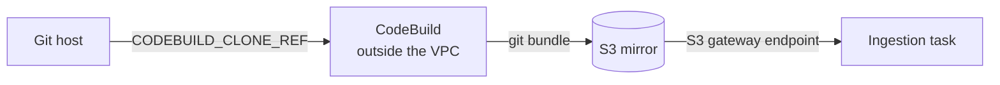
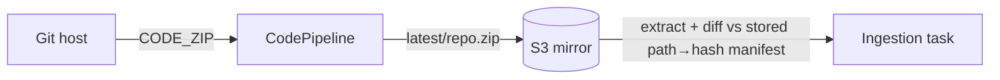
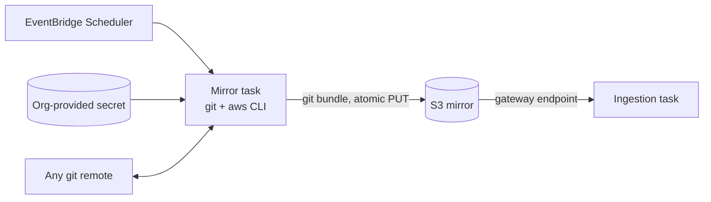

# RFC-0005: Git repository acquisition mechanism

- **Status:** Open — candidates listed, **no decision made**
- **Author:** eugenelim
- **Approver:** TBD
- **Date opened:** 2026-09-21
- **Date closed:** —
- **Related:** [ADR-0016](../adr/0016-git-ingestion-commit-sha-delta-medallion.md) (the decision this revisits — §2 only); [ADR-0002](../adr/0002-ephemeral-vpc-store-topology.md) (no-NAT egress posture); [ADR-0011](../adr/0011-neptune-sparql-rdf-engine-and-text2sparql-guard.md) (`ingestion_task_role` write grant); [RFC-0004 §D6](0004-biz-ops-kg-pivot.md) (git commit-SHA delta + medallion); [RFC-0002](0002-ingestion-pattern-axis.md) (ingestion as a first-class pattern axis); [`architecture/biz-ops-knowledge-graph/ingestion.md`](../architecture/biz-ops-knowledge-graph/ingestion.md) (the as-built divergence register)

> **This RFC does not pick a winner.** It exists to be reviewed with the team
> before any mechanism is chosen. Four acquisition candidates are presented with
> their real costs, alongside a **separate storage-persistence axis** (candidate E)
> that composes with them rather than competing; the decision is the outcome of the
> review, not the content of this document.

## The ask

- **Recommendation (BLUF):** None yet, by design. Review the four acquisition
  candidates below and select one, then settle the separate working-storage axis
  (candidate E) — two decisions, not one. Both are recorded in **ADR-0021**, logged
  now as `Proposed`, which supersedes **ADR-0016 §2** (git remote egress) and carries
  the rest of ADR-0016 forward unchanged.
- **Why now (SCQA):** *Situation* — ADR-0016 chose git commit-SHA delta as the
  ingestion change signal, and the medallion pipeline, artifact keying, and store
  coordination built on that choice all work. *Complication* — the mechanism that
  delivers git content to the ingestion task does not, and cannot. The deployed
  CodePipeline emits a history-free ZIP, while the delta reader needs git history
  and the orchestrator needs per-file S3 objects; three artifacts describe three
  incompatible mechanisms, and ADR-0016's own text describes a fourth that was
  never built. Separately, the requirement has widened: the platform must ingest
  from **any git service**, including an internal self-managed GitLab, and the
  AWS-native path cannot be fully provisioned by IaC for those hosts.
  *Question* — how should the ingestion task acquire repository content and compute
  a correct delta, given a VPC with no NAT gateway, an arbitrary git host, and a
  credential the adopting organisation owns rather than us?
- **Decisions requested:**
  1. **Select one acquisition candidate** (A, B, C, or D below). · no recommendation · decide-by: review meeting.
  2. **Confirm the hard requirements** in the next section are complete and correctly ranked. · decide-by: review meeting.
  3. **Confirm the supersession scope** — §2 alone for A, C, and D; §2 plus §1's *diff-mechanism* sentence for B. The commit SHA remains the change signal in every candidate, so §1's signal choice is never superseded. · recommended · decide-by: with decision 1.
  4. **Decide the working-storage axis separately** — ephemeral per-task storage (status quo) or a provisioned volume for the working clone (**candidate E**, below). This is orthogonal to decisions 1–3 and composes with A, B, or C; selecting D makes it moot. · no recommendation · decide-by: review meeting.

## Problem & goals

**Diagnosis.** The failure here is not that a mechanism was chosen badly; it is that
four artifacts each describe a different mechanism and none of them was reconciled
against the others. The evidence is tabulated in the ingestion architecture
document's as-built divergence register and is not repeated here. The operational
consequence is that a delta run cannot compute a delta, and nothing reports this as
a failure — the status registry records that the task exited, not that the delta
was right.

The widening requirement compounds it. `CODEBUILD_CLONE_REF`, the only CodePipeline
source format carrying git metadata, "can only be used by CodeBuild downstream
actions" and errors elsewhere. For a self-managed GitLab, CodeConnections
additionally requires a host resource with VPC networking and — decisively for a
clone-and-deploy reference template — a manual console step that no IaC can
complete.

**Goals.**

- Deliver repository content to the VPC-private ingestion task so that a **correct**
  add/modify/delete/rename set can be computed.
- Work against **any git service**: GitHub, GitHub Enterprise Server, GitLab.com,
  internal self-managed GitLab, or another host.
- Keep the ingestion subnet free of a NAT gateway, and keep the whole path
  provisionable by IaC.
- Consume an **organisation-provided** credential without owning its lifecycle.
- Make a delta that cannot be computed correctly **loud**, not silent.
- Decide, separately from the mechanism, **whether the working copy persists between
  runs** — today it does not, and that has never been a deliberate choice.

**Non-goals** (could have been goals; deliberately dropped):

- **Changing the change signal itself.** ADR-0016's choice of commit SHA as the
  authoring signal stands in every candidate — it remains the provenance key and the
  manifest base. Candidate B changes only *how the diff is computed*, which is §1's
  mechanism sentence, not its signal choice.
- **Re-opening the medallion structure, artifact keying, or store coordination.**
  All ADR-0016 sub-decisions except §2 are unaffected; the enumeration lives in
  Consequences rather than being restated here.
- **Supporting a corpus that is not git-tracked.** The `BronzeSource` seam stays
  pluggable (ADR-0016 §8), but no second source implementation is in scope.
- **Solving git submodules or git LFS.** Both remain out of scope, as in ADR-0016 §6.
  Submodules are a known undesigned gap; a superproject's tree contains gitlink
  entries, not nested content, and no candidate changes that.
- **Owning credential rotation.** Explicitly the organisation's.

## Hard requirements

A candidate that fails any of these is not viable. Ranked by business importance ×
architectural risk.

| # | Requirement | Why it ranks here |
|---|---|---|
| H1 | The delta is correct, or the run fails loudly | A wrong delta silently corrupts the graph with no operational signal. The worst failure available to this system. |
| H2 | No NAT gateway on the ingestion subnet | ADR-0002's carried-forward controls, and the Text2SPARQL and kNN guards, depend on the no-egress posture. RFC-0004 § Security posture puts this out of bounds. |
| H3 | Works against any git service, including internal self-managed | Stated platform requirement. Eliminates anything bound to a fixed provider list. |
| H4 | Fully provisionable by IaC | The charter promises a reproducible clone-and-deploy demo. A manual console step in the ingestion path breaks that promise. |
| H5 | Consumes an org-provided credential, owns no rotation | The adopting organisation's secret management is authoritative. |
| H6 | Fits the working-storage budget available to it | 20 GiB ephemeral default minus both image forms; unmeasured today. A candidate that cannot fit is not deployable. Candidate E changes which budget applies — a provisioned volume is sized independently — but not the requirement to measure before sizing, so H6 binds on both axes. |

## The four acquisition candidates

### Candidate A — CodePipeline + CodeBuild full-clone, bundle to S3

Switch the source action to `CODEBUILD_CLONE_REF`; add a CodeBuild stage that
full-clones the repository and writes `git bundle create --all` output to S3. The
ingestion task downloads the bundle and reconstructs a bare repository.

- **For:** `_delta.py` works unchanged; real git semantics including rename detection; CodeBuild's egress happens in an AWS-managed account, so no NAT in our VPC; AWS manages the source credential.
- **Against:** **Partial on H3, fails H4.** CodeConnections does support GitHub Enterprise Server and self-managed GitLab via a host resource, so H3 fails only for hosts outside its provider list — but the connection cannot be driven to `AVAILABLE` without a console step, which fails H4 per environment. Largest disk footprint (bundle + clone, scaled by history). Adds a second AWS service to the ingestion path.

### Candidate B — Keep `CODE_ZIP`, diff two trees in Python

Keep the deployed source format. The task extracts the ZIP and diffs it against a
stored path→content-hash manifest from the previous run. No git binary.

- **For:** Smallest infrastructure change; no CodeBuild; no git dependency; the manifest mechanism already exists in the codebase for the pre-pivot path. Holds one extracted tree plus a small hash index — not two corpus copies.
- **Against:** **Partial on H3, fails H4**, for the same CodeConnections reasons as A. **Losing historical-byte access is its real disqualifier**: the Bronze read path needs a path's bytes as of a given commit, and an extracted tree only has HEAD. Losing rename detection matters less than it looks — `_delta.py:155-162` already decomposes every `R<pct>` entry into a delete-old plus an add-new, so the shipped pipeline carries no rename semantics downstream today. Re-introduces content-hash diffing, which ADR-0016's Context section rejected — though the rejection reason was that an S3 content hash misses the authoring signal, and here the commit SHA still arrives from CodePipeline for provenance, so the objection is weaker than it first appears.

### Candidate C — Self-hosted mirror task, plain git, any remote

Replace the CodePipeline source action, the CodeBuild hop, and the connection with a
short-lived Fargate "mirror" task running `git` against any remote, writing a bundle
to S3 with a single atomic `PUT`. EventBridge Scheduler wakes it; it runs
`git ls-remote` to compare remote HEAD against the stored SHA and exits immediately
if unchanged.

Network placement is chosen by where the git host lives; the ingestion task is
identical in all cases because it only ever reads the same S3 artifact.

| Git host | Mirror task placement | Internet egress |
|---|---|---|
| Public SaaS | Public subnet, public IP, egress-only SG | Via IGW — still no NAT gateway |
| Internal, VPC-reachable via VPN / Direct Connect / peering | Private subnet | **None anywhere in the system** |
| Internal, not VPC-reachable | Out of scope — adopter publishes the bundle | — |

- **For:** **Meets H3 and H4** — plain git works against any remote, and the whole path is IaC-provisionable. Real git semantics like A. For an internal VPC-reachable host, needs no internet at all, which is a better posture than today. Polling avoids a public webhook endpoint entirely.
- **Against:** We now operate a component AWS was operating. Change latency becomes the poll interval rather than near-instant. The public-subnet variant creates an internet-facing ENI — an ADR-0002 posture question even with an egress-only security group. Same history-scaled disk cost as A (H6 pressure). Introduces a long-lived credential boundary, triggering a `security-reviewer` spec-stage pass per AGENTS.md.

### Candidate D — Service account against the host's REST API

No git binary and no repository on disk. A service account calls the host's compare
API for the delta and its file-contents API for Bronze bytes, behind a small adapter
with one implementation per host family.

| Host | Delta endpoint | Rename signal | Truncation signal |
|---|---|---|---|
| GitHub / GHES | `GET /repos/{owner}/{repo}/compare/{basehead}` | `status: renamed` + `previous_filename` | **Implicit** — up to 300 changed files "for the entire comparison", first page only |
| GitLab (.com and self-managed) | `GET /projects/:id/repository/compare` | `renamed_file` + `old_path` | **Explicit** — `compare_timeout: true` means diffs "might be incomplete"; per-entry `collapsed` and `too_large` |

- **For:** **Meets H3, H4, H5 and is strongest on H6** — the repository never touches disk, so working storage collapses to staging plus scratch. For an internal VPC-reachable GitLab, the ingestion task can call the API directly and no mirror component exists at all. Uses exactly the org-provided service account the organisation already manages.
- **Against:** **H1 is the live risk.** GitHub truncates at 300 files with no flag — the check must be `len(files) == 300` treated as "unknown, rescan", and getting that wrong is precisely the silent-staleness failure. Two API dialects to maintain behind the adapter; portability becomes a seam we own rather than a property we get free. Rate limits and per-file content fetches add failure modes git does not have. GitHub's compare endpoint also caps the commit list when unpaginated, which interacts with long gaps between runs — the exact figure needs confirming against the compare endpoint reference before the review.

## Comparison against the hard requirements

This matrix covers the **acquisition axis only**. Candidate E's composed profile is
tabulated in its own section below.

| | H1 correct delta | H2 no NAT | H3 any host | H4 IaC-complete † | H5 org credential | H6 storage |
|---|---|---|---|---|---|---|
| **A** CodeBuild bundle | Yes — real git | Yes | Partial — CodeConnections providers only | **No** (per environment) | AWS-managed | Largest |
| **B** ZIP tree-diff | **No** — loses historical bytes | Yes | Partial — CodeConnections providers only | **No** (per environment) | AWS-managed | Moderate |
| **C** Self-hosted mirror | Yes — real git | Yes (private-subnet) / **posture question** (public-subnet) | Yes | Yes (per organisation) | Yes | Largest |
| **D** Host REST API | **Conditional** — needs truncation check | Yes | Yes | Yes (per organisation) | Yes | **Smallest** |

† **All four candidates require one out-of-band human step.** A and B need a console
connection handshake; C and D need an organisation-issued credential placed in secret
storage. What the H4 column actually scores is whether that step repeats **per
environment** (A, B) or happens **once per adopting organisation** (C, D) — a
difference of degree, not of kind. The review should decide whether it deserves the
weight this matrix gives it.

C's H2 cell is split deliberately. H2's justification is not the literal absence of a
NAT resource but the no-egress posture the Text2SPARQL and kNN guards depend on. C's
public-subnet variant places an internet-facing ENI inside the VPC, which is an
ADR-0002 posture question even with an egress-only security group; only the
private-subnet variant is an unqualified yes.

A and B fail H4 as currently stated and are partial on H3; B additionally fails H1.
If the review concludes H3 or H4 is softer than written — that the platform only ever
targets CodeConnections-supported hosts, or that a per-environment console step is
acceptable — then A returns as a serious contender, which is why decision 2 asks the
team to confirm the requirements before decision 1.

## A second axis: where the working clone lives

Candidates A–D all answer one question — how repository content crosses the network
boundary into a VPC with no NAT gateway. A second question rides alongside it and has
never been asked explicitly: **does the working copy survive between runs?** Today it
does not. `/work` is per-task ephemeral storage on the 20 GiB Fargate default, and
every run rebuilds the repository from nothing.

Candidate E is that axis. It is **not a fifth acquisition mechanism** — it composes
with A, B, or C rather than competing with them, which is why decision 4 asks for it
separately. It is moot under D, which keeps nothing on disk.

### Candidate E — a provisioned volume for the working clone

Attach a KMS-encrypted gp3 volume to the ingestion task and keep the bare repository
on it, so a run runs `git fetch` against a warm object store instead of reconstructing
one.

E splits into two sub-shapes with very different costs, because **ECS does not offer
the reattachable-volume semantics this pattern assumes on other platforms**:

> "You can attach at most one Amazon EBS volume to each Amazon ECS task, and **it must
> be a new volume. You can't attach an existing Amazon EBS volume to a task.** However,
> you can configure a new Amazon EBS volume at deployment using the snapshot of an
> existing volume."
> — [Use Amazon EBS volumes with Amazon ECS](https://docs.aws.amazon.com/AmazonECS/latest/developerguide/ebs-volumes.html), *Considerations*

A Kubernetes `PersistentVolumeClaim` rebinds the same volume to the next pod. ECS has
no equivalent, and that one sentence is the whole distance between E1 and E2.

**E1 — a fresh, right-sized volume per run.** `configuredAtLaunch` on the task
definition, `volumeConfigurations` supplied at `RunTask`, `sizeInGiB` set from
measurement. Buys working-storage headroom and nothing else: the repository is still
rebuilt every run.

**E2 — a warm clone that survives between runs.** Requires either a snapshot
round-trip or EFS in place of EBS. EFS persists across tasks with no snapshot
machinery, but it is a shared filesystem rather than a single-attach device and it
puts a git object store on NFS.

**The snapshot byte path, spelled out.** Because the volume is new every run, "warm"
means *restored*, not *retained*. Run *N* finishes; its volume is preserved
(`deleteOnTermination: false`, available for standalone tasks only) and snapshotted.
Something must observe the task stopping, resolve the ECS-created volume ID from the
task's attachments, and snapshot it — that observer does not exist today and is a
second new component. Run *N+1* then creates its volume from that `snapshotId`,
applies whatever the acquisition candidate delivered — C's bundle from S3, A's
bundle, or B's extracted tree — and a scheduled reaper deletes the superseded volume
and aged-out snapshots. The
warm object store is real, but it costs one snapshot create and one snapshot restore
per run plus an orphan-reaping path, and any scoring of E2 that omits those is scoring
a shape that does not exist.

**For:**

- **Improves H1 under A and C.** A warm object store means `last_sha` is reachable
  locally and ancestry is verifiable against real history, without reconstructing a
  bare repository from a bundle first.
- **Moves the repository term off the ephemeral allocation**, leaving the image and
  scratch on it. Volume size becomes an independent dial rather than a 20 GiB ceiling,
  which changes the shape of the H6 pressure rather than removing the need to measure.
- **E2 replaces a full clone per run with an incremental fetch**, cutting per-run
  clone time and egress — against which the snapshot costs above must be netted.

**Against:**

- **H4 — EventBridge cannot carry a volume configuration at all, and this is an AWS
  API limit rather than a Terraform gap.** EventBridge's
`EcsParameters` has no volume field on **either** of the two relevant APIs — the
  [Rules API](https://docs.aws.amazon.com/eventbridge/latest/APIReference/API_EcsParameters.html)
  behind `aws_cloudwatch_event_target` and the
  [Scheduler API](https://docs.aws.amazon.com/scheduler/latest/APIReference/API_EcsParameters.html)
  behind `aws_scheduler_schedule`, which candidate C would use. Both accept
  `TaskDefinitionArn`, `NetworkConfiguration`, `LaunchType`, `PlacementConstraints`,
  `PropagateTags`, `Tags` and `TaskCount`, and no volume field. Neither provider
  resource can express what its API will not accept. The deployed
  trigger is a direct EventBridge → ECS target
  (`apps/infra-tf/git_ingestion_trigger.tf`), so E requires replacing it with a Lambda
  that calls `ecs:RunTask` with `volumeConfigurations`. **H4 is still Yes** — a shim is
  IaC-provisionable, unlike a console step — but at the cost of a new component in the
  ingestion path, and it will not be resolved by a provider release.
- **E2 makes concurrent runs more dangerous, not less.** Because ECS creates a *new*
  volume per task, two concurrent runs receive two volumes and nothing serialises them;
  under E2 both restore the same snapshot and diverge, and because the next run
  resolves a single latest-snapshot pointer, one run's writes are simply never seen
  again. The single-flight gap ADR-0021 records as unowned therefore becomes **more**
  urgent under E2, not structurally closed by it — a single-attach device would give
  mutual exclusion only if tasks shared one volume, which ECS forbids. Under E1 there
  is no shared snapshot, so concurrency risk is unchanged from today's R3 rather than
  worsened.
- **E2 conflicts with the charter as literally written.** `CHARTER.md` § Principles 4:
  "one `destroy` removes every billable resource, idle cost is bounded and documented,
  and a Budgets alarm guards the cloned-and-forgotten footgun. **A demo that accrues
  silent standing cost is a broken demo.**" A volume or snapshot that outlives
  `terraform destroy` is exactly that. Note that the pattern E is modelled on retains
  **user-supplied** codebases; here the corpus is a public repository that can be
  re-cloned in minutes, so the data is *reproducible* and the safety argument does not
  transfer. If E2 is selected, the retained artifact must sit in the teardown path and
  be covered by the teardown check.
- **Per-run recurring cost, all of it unmeasured.** EBS attach latency on every task
  start; provisioned gp3 charges for each per-run volume, billed on provisioned
  capacity rather than usage; and for E2, snapshot create time and snapshot storage.
  These recur every run, unlike the one-off provisioning costs A–D carry, and none of
  them is measured today.
- **The volume cannot be sized yet.** The borrowed 100 GiB figure is sized for a
  different problem. This corpus is the Kubernetes `community` + `enhancements`
  repositories, which — estimating from the corpus shape rather than from measurement
  — is low single-digit GiB as a bare clone with full history. That estimate is
  unverified, and the real number comes from the same measurement H6 is already
  blocked on.
- **Triggers a `security-reviewer` spec-stage pass**, as candidate C does: E adds an
  ECS infrastructure IAM role, a KMS grant for the volume key, and — for E2 — a
  retained artifact holding corpus bytes outside the task lifetime.
- **E1 on its own does not improve H1.** It buys headroom, which setting
  `ephemeral_storage` on the existing task definition also buys, as a one-line change
  without E's machinery. The review should be satisfied that it wants more than
  headroom before taking E1.
- Fargate EBS attachment is **Linux-only** and unavailable in `use1-az3`, which
  narrows the eligible subnets.

### How E scores, composed

E does not move H2, H3 or H5 — it touches neither the network path nor the credential.
Its effect is confined to H1, H4 and H6, so only those columns are restated here
against whichever of A, B or C the review selects.

| Composition | H1 correct delta | H4 IaC-complete | H6 storage |
|---|---|---|---|
| **A / B / C alone** (baseline) | as scored in the acquisition matrix | as scored there | capped at the 20 GiB allocation |
| **+ E1** | unchanged | Yes, via a `RunTask` shim | volume-sized, still unmeasured |
| **+ E2** | improved — warm local history, **conditional on single-flight**: without it, concurrent runs diverge and one run's writes are lost | Yes, via a `RunTask` shim **plus a task-stop snapshot path and a reaper** | volume-sized, still unmeasured |
| **D + E** | moot — D keeps nothing on disk | — | — |

E composes with B as well as with A and C: B's stored path→content-hash manifest is
exactly the kind of state that benefits from surviving a run, so decision 4 remains
live under B. Only D settles decision 4 by making it irrelevant.

> **On the naive form of this pattern.** If the clone runs *inside* the ingestion task
> — as it does in the system E is modelled on, where one backend pod both clones and
> processes — the task needs egress from the ingestion subnet, and **H2 fails**.
> Candidate E as scored above assumes the bytes arrive by the selected acquisition
> candidate's path and the volume only holds the accumulated result. Collapsing
> acquisition and processing into one compute unit is precisely what the no-NAT
> posture forbids.

**What was deliberately not carried over.** E is modelled on a deployed pattern
described to us second-hand: one EBS-backed volume, `ReadWriteOnce`, KMS-encrypted,
`Retain` reclaim, 100 GiB, with every onboarded codebase a slug-sanitised
subdirectory side by side. **Those specifics are reported, not verified, and none of
E's scoring above depends on them.** Two properties are deliberately dropped.
`Retain` is the charter conflict above. **Side-by-side codebases are dropped
entirely** — that design exists to host arbitrary user-supplied repositories and pays
for it with a path-traversal guard on user-controlled slugs, a security boundary this
platform would then own and have to defend. Here the corpus is fixed and partitioned
by named graph (ADR-0012), with access control as synthetic labels (ADR-0009).
Importing path-based multi-tenancy would buy isolation the graph layer already
expresses.

---

## Cross-cutting: what every candidate must do

Independent of both decisions, and not itself under review:

- **Keep the repository bare** where one exists on disk. Verified: a bare repository
  supports `diff --name-status -M` and `show <sha>:<path>`; a worktree is a second
  full copy of the corpus for no benefit.
- **Assert delta correctness and fail loudly** when it cannot be established (H1).
  The empty-tree full-rescan fallback already exists as the recovery path.
- **Distinguish "no changes" from "could not determine changes"** in the status
  registry, so an expired credential does not read as a quiet corpus.
- **Measure the container image's ephemeral-storage contribution** and set
  `ephemeral_storage` from the measurement. The same number sizes candidate E's
  volume, so the measurement is a prerequisite for decision 4 as well as decision 1.
- **Log and fail on an unhandled `git diff` status code.** `_delta.py:169` currently
  skips `C`, `T`, and friends silently, dropping genuinely changed files out of the
  delta. A determinate three-line fix, unaffected by the candidate choice.
- **Verify `last_sha` is an ancestor of HEAD** before trusting a diff, so a
  force-push or a depth-window miss triggers a rescan rather than a wrong delta.
- **Do not implement ADR-0016 §5's `DROP GRAPH` literally.** [`spec-git-ingestion`](../specs/spec-git-ingestion/spec.md)
  forbids it — dropping `urn:graph:normative` destroys the whole partition — and
  requires partition-scoped `DELETE WHERE`. Out of this RFC's scope; it needs its own
  ADR and is named in ADR-0021's open questions.

## De-risk

- The bare-repository claim was verified against a real repository, not assumed —
  rename detection returned `R100  docs/a.md  docs/renamed.md`, matching the format
  `_delta.py` already parses.
- The CodePipeline format constraints, CodeConnections host and console-handshake
  requirements, Fargate ephemeral-storage contract, and both compare-API truncation
  behaviours are grounded in current vendor documentation and quoted in the
  architecture document and above — except GitHub's unpaginated commit-list cap and
  GitLab's per-entry `collapsed` / `too_large` on the compare response, both of which
  are flagged above as still needing confirmation.
- Candidate E's blocking constraints were read from vendor sources rather than
  assumed: the "must be a new volume" rule and the Fargate platform, Linux-only and
  `use1-az3` limits from the ECS EBS-volumes documentation; the `deleteOnTermination`
  standalone-task carve-out and the `volumeConfigurations` shape from the ECS
  deployment-configuration reference; and the absence of any volume field from the
  EventBridge `EcsParameters` API reference. Accessed 2026-09-22.
- The EventBridge constraint was traced to the **right layer**. An open Terraform
  provider issue ([#43350](https://github.com/hashicorp/terraform-provider-aws/issues/43350))
  describes the missing argument, but the underlying `EcsParameters` API has no volume
  field either, so this is not a provider gap that a release will close. What to
  re-check at review time is the **AWS API**, not the provider.
- Unverified and flagged: the container image's actual size, and therefore real
  ephemeral headroom. No candidate's H6 column can be made quantitative until it is
  measured — and candidate E's volume sizing is blocked on the same number.
- Unverified and flagged: the bare-clone size estimate behind E's sizing bullet
  ("low single-digit GiB"), which is inferred from the corpus shape and has not been
  measured.
- Unverified and flagged: E's per-run costs — EBS attach latency, per-run provisioned
  gp3 charges, and E2's snapshot create time and storage. All recur every run and none
  is measured.
- Reported but not verified: the specifics of the deployed pattern E is modelled on
  (100 GiB, `Retain`, slug-sanitised subdirectories). None of E's scoring depends on
  them.

## Consequences

On acceptance:

1. **ADR-0021** records the selected mechanism and supersedes **ADR-0016 §2**
   (git remote egress). Supersession is scoped to the sub-decision, following the
   convention ADR-0011 and ADR-0014 already use — a `Supersedes:` line naming the
   part superseded and the part carried forward. ADR-0016's remaining sub-decisions
   (§1 change signal, §3 medallion layers, §4 artifact keying, §5 store
   coordination, §6 LFS, §7 unsupported MIME, §8 pluggable seam, §10 scale
   envelope, §11 Gold lifecycle, §12 manifest) stand unchanged and are not
   restated. **If candidate B is selected, §1's diff-mechanism sentence is
   superseded as well**; §1's choice of the commit SHA as the change signal stands
   regardless of the candidate.
2. ADR-0016's status gains a scoped note naming which sub-decision was superseded;
   its body is untouched, per the Frozen-layer rule. No status change is made while
   ADR-0021 is `Proposed`.
3. [`spec-git-ingestion`](../specs/spec-git-ingestion/spec.md) is amended in the implementing PR — spec drift is a bug.
4. The ingestion architecture document's divergence register is replaced by a
   description of the built mechanism — and with it the candidate-E cross-references
   this RFC seeded there (the Scope fence, the "What Fargate offers beyond ephemeral
   storage" section, the disk-budget and Lifecycle pointers, and the Open-decisions
   rows), all of which go stale on selection.
5. **If candidate E is selected**, ADR-0021 records the storage-persistence decision
   alongside the acquisition one, and the EventBridge → ECS trigger is replaced by a
   `RunTask` shim (see E's H4 cost). E2 additionally requires the retained volume and
   its snapshots to be named in the teardown path, so the charter's "`destroy` removes
   every billable resource" check still holds, and a reaper for superseded volumes and
   aged-out snapshots. **Single-flight enforcement stops being deferrable**: E does not
   close the concurrent-run gap ADR-0021 records as unowned, it sharpens it, because
   two concurrent runs restoring one snapshot lose writes. It must gain an owner in the
   same decision.
